# 面向 CV 模型的数据质量管控系统

> 基于 PySpark 的大规模图像清洗管道 | 阿里云 ECS 三节点分布式集群

[](https://www.python.org/)
[](https://spark.apache.org/)
[](https://hadoop.apache.org/)

---

## 📖 项目概述

本项目构建了一条端到端的图像数据清洗管道，从 Kaggle 获取 Dogs-vs-Cats 数据集，通过清晰度过滤、感知哈希去重、尺寸统一等步骤，输出可直接用于 CV 模型训练的干净数据集（Parquet 格式）。

**核心特点**：
- 🔥 **真实分布式集群**：阿里云 ECS 3 节点（1 Master + 2 Worker），非单机模拟
- 🧹 **多阶段清洗**：清晰度评估 → 感知哈希去重 → 尺寸标准化
- 📦 **即开即用**：输出 Parquet 文件包含图片二进制数据 + 标签，下游直接训练

---

## 🏗️ 管道架构

```mermaid
graph TB
    subgraph "📥 1. 数据获取"
        A1["🌐 Kaggle API<br/>Dogs vs Cats 数据集"] --> A2["📁 采样 500 张<br/>猫 250 + 狗 250"]
        A2 --> A3["☁️ 上传 HDFS<br/>/input/"]
    end

    subgraph "📖 2. 数据读取"
        A3 --> B1["spark.read.format('binaryFile')<br/>每张图 → DataFrame 一行"]
        B1 --> B2["📊 500 行<br/>path | content | length"]
    end

    subgraph "🔍 3. 清晰度过滤"
        B2 --> C1["UDF: Laplacian Variance<br/>cv2.Laplacian + .var()"]
        C1 --> C2["📊 describe() 分析分布<br/>min=7.5, max=60809"]
        C2 --> C3["🎯 阈值 = 20<br/>过滤 5 张极模糊图片"]
        C3 --> C4["📊 剩余 495 张"]
    end

    subgraph "🔑 4. 特征提取"
        C4 --> D1["UDF: imagehash.phash()<br/>64 位感知哈希"]
        D1 --> D2["📊 每张图 → 指纹字符串<br/>如: ec63c71c9a90b993"]
    end

    subgraph "📏 5. 相似去重"
        D2 --> E1["自连接 (Self-Join)<br/>col(a.path) < col(b.path)"]
        E1 --> E2["UDF: Hamming Distance<br/>XOR + bit count"]
        E2 --> E3["🎯 阈值 ≤ 10<br/>发现 0 对重复"]
    end

    subgraph "💾 6. 标准化输出"
        E3 --> F1["UDF: Resize 224×224<br/>PIL Image.LANCZOS"]
        F1 --> F2["提取 label 列<br/>cat_001.jpg → cat"]
        F2 --> F3["write.parquet()<br/>path | label | sharpness | phash | image_data"]
        F3 --> F4["✅ 最终产物<br/>495 条记录 · Parquet 格式"]
    end

    style A1 fill:#42A5F5,color:#fff
    style C1 fill:#FF7043,color:#fff
    style D1 fill:#AB47BC,color:#fff
    style E1 fill:#EF5350,color:#fff
    style F1 fill:#66BB6A,color:#fff
    style F4 fill:#2E7D32,color:#fff
```



---

## 📊 处理结果

| 阶段 | 输入 | 输出 | 过滤/去除 |
|------|------|------|-----------|
| 原始数据 | — | 500 张 | — |
| 清晰度过滤 | 500 | 495 | 5 张（阈值 20） |
| 感知哈希去重 | 495 | 495 | 0 对重复 |
| **最终保存** | — | **495 张** | — |

### 猫狗分布

| 类别 | 数量 |
|------|------|
| 🐱 Cat | 248 |
| 🐶 Dog | 247 |

清晰度过滤对类别无偏斜（原始 250:250，过滤后猫狗数量仍然接近 1:1）。

### 清晰度统计（过滤后）

| 指标 | 数值 |
|------|------|
| 最小值 | 22.72 |
| 最大值 | 60809.33 |
| 均值 | 1207.72 |

---

## 🛠️ 技术栈

| 层级 | 技术 | 用途 |
|------|------|------|
| 集群管理 | Hadoop 3.3.6 (HDFS + YARN) | 分布式存储 + 资源调度 |
| 计算引擎 | Spark 3.5.5 (PySpark) | 分布式图像处理 |
| 图像处理 | OpenCV 4.x + Pillow | 清晰度计算 + Resize |
| 特征提取 | imagehash (pHash) | 感知哈希指纹 |
| 存储格式 | Parquet (Snappy 压缩) | 列式存储，下游直接读取 |
| 数据来源 | Kaggle API | Dogs vs Cats 数据集 |
| 开发环境 | Jupyter Lab + YARN Client | 交互式开发，直接提交集群 |

---

## 📁 项目结构

```
image-pipeline/
├── README.md                               # 项目说明（含架构流程图）
├── requirements.txt                        # Python 依赖（Pillow/OpenCV/imagehash/PySpark）
├── LICENSE                                 # MIT
├── .gitignore
├── data/
│   ├── raw/.gitkeep                        # 原始图片目录（从Kaggle下载后放这里）
│   └── output/.gitkeep                     # Parquet输出目录（管道运行后生成）
│                                           # 💡 注：数据本身存于HDFS，不随Git上传
├── notebooks/                              # Jupyter Notebook（学习路径）
│   ├── 01_Spark_DataFrame基础练习.ipynb        ← CSV读写、Parquet、分布式验证
│   ├── 02_图像初次处理_测试版.ipynb             ← 14图→500图，binaryFile、pHash、自连接
│   ├── 03_完整清洗管道_W3版本.ipynb             ← W3周日，清晰度→去重→Parquet（无Resize）
│   └── 04_完整清洗管道_Resize224_封板.ipynb     🔒 最终封板版（含Resize+label）
├── docs/
│   └── 集群操作手册.md                      # 阿里云ECS启动/关闭/常用命令
├── notes/                                  # 理论学习笔记
│   ├── 前置知识-W3周二-扩充版.md              # SparkSession、DataFrame、HDFS架构、Catalyst优化器
│   ├── 前置知识-W3周三-扩充版.md              # binaryFile、UDF、pHash、汉明距离、自连接去重
│   ├── 前置知识-W3周日-扩充版.md              # 拉普拉斯清晰度、Kaggle API、阈值方法论、管道设计
│   └── Harness概念理解.md                   # Prompt→Context→Harness、CNN类比、面试话术
└── screenshots/                            # 集群运行截图
    ├── 1-yarn-active-nodes.png             # YARN 活跃节点（证明2个Worker在运行）
    ├── 3-spark-jobs-list.png               # Spark 任务列表
    └── 4-executor-hosts-master-worker1-worker2.png  # Executor 分布（证明分布式执行）
```

---

## 🚀 快速开始

### 环境要求

| 组件 | 版本 | 说明 |
|------|------|------|
| Java | JDK 11 | Hadoop/Spark 运行在 JVM 上 |
| Hadoop | 3.3.6 | HDFS + YARN，三节点集群 |
| Spark | 3.5.5 | PySpark on YARN，每个 Executor 分配 2GB |
| Python | 3.10+ | 所有节点（Master + Worker）必须统一版本 |
| 操作系统 | Ubuntu 22.04 LTS | 本项目实际环境 |
| 集群节点 | 3 台（1 Master + 2 Worker） | 阿里云 ECS，每台 4vCPU 8GB |

### 安装依赖

```bash
# 在所有节点（Master + 所有 Worker）上执行
pip install -r requirements.txt -i https://mirrors.aliyun.com/pypi/simple/
```

> ⚠️ **关键**：`Pillow`、`opencv-python`、`imagehash` 必须在**每个 Worker 节点**上都安装。UDF 在 Executor 上执行，Master 单独装没用。

### 准备数据

```bash
# 1. 下载完整数据集（25000 张猫狗图片）
kaggle datasets download -d shaunthesheep/microsoft-catsvsdogs-dataset --unzip

# 2. 采样 500 张（猫 250 + 狗 250）作为实验子集
#    原始数据解压后在 PetImages/Cat/ 和 PetImages/Dog/ 目录下
mkdir -p data/raw
cp PetImages/Cat/*.jpg data/raw/cat_*.jpg 2>/dev/null | head -250
cp PetImages/Dog/*.jpg data/raw/dog_*.jpg 2>/dev/null | head -250

# 3. 上传到 HDFS
hdfs dfs -mkdir -p /user/root/image-pipeline/input/
hdfs dfs -put data/raw/*.jpg /user/root/image-pipeline/input/
```

### 启动集群

```bash
start-dfs.sh && start-yarn.sh
yarn node -list    # 确认 2 个 NodeManager 为 RUNNING
jps                # Master 应有 NameNode、SecondaryNameNode、ResourceManager
```

### 运行管道

```bash
jupyter lab --ip=0.0.0.0 --port=8888 --no-browser --allow-root
# 打开 notebooks/04_完整清洗管道_Resize224_封板.ipynb，依次运行所有 Cell
```

### 读取处理结果

```python
df = spark.read.parquet("/user/root/image-pipeline/output/cleaned_images_224.parquet")
df.printSchema()
# root
#  |-- path: string
#  |-- label: string       ← cat 或 dog
#  |-- sharpness: float    ← 清晰度分数
#  |-- phash: string       ← 感知哈希指纹
#  |-- image_data: binary  ← 224×224 JPEG 字节

df.groupBy("label").count().show()
# +-----+-----+
# |label|count|
# +-----+-----+
# |  cat|  248|
# |  dog|  247|
# +-----+-----+
```

---

## 🎯 关键设计决策

| 决策 | 选择 | 原因 |
|------|------|------|
| 存储格式 | Parquet | 列式存储，下游分析只读需要的列；压缩率高 |
| 去重算法 | pHash + 汉明距离 | 感知哈希对压缩/缩放鲁棒，不像 MD5 一个像素不同就全不同 |
| 清晰度指标 | 拉普拉斯方差 | 检测边缘强度，方差大 = 边缘多 = 图片清晰 |
| 阈值选择 | 20（清晰度）、10（去重） | 保守策略：只去掉明确有问题的，宁留勿杀 |
| 图片尺寸 | 224×224 | 兼容主流 CNN 预训练模型（ResNet、VGG 等） |
| 处理顺序 | 清晰度→去重→Resize | O(n) 先行削减数据量，O(n²) 随后；Resize 不可逆放最后 |

---

## 📐 常见问题

1. **为什么用分布式？** 500 张图单机就能跑，但架构按百万级设计。Spark on YARN 的数据本地性——Executor 和 DataNode 部署在同一节点，计算被调度到数据所在位置，避免大量数据经网络传输。

2. **管道顺序为什么是「清晰度→去重→Resize」？** 清晰度过滤 O(n)，自连接去重 O(n²)。轻量操作先削减数据量。Resize 放最后——224×224 是不可逆的，只对确定保留的图片执行。

3. **为什么 Parquet 而不是 CSV？** 列式存储——下游分析只读 sharpness/phash 列时不用扫全表。内置压缩和 Schema，比 CSV 小 3-5 倍。

4. **阈值怎么定的？** describe() 看分布 → orderBy 看最低分样本 → 人眼确认。清晰度 20 刚好隔离 5 张极模糊图，去重 10 是保守值——对训练数据来说误删好图比保留重复代价更大。

5. **数据量扩到 100 万张怎么改？** 自连接 O(n²) 换成 LSH 分桶 + 桶内精确比较；逐行 UDF 换 Pandas UDF（Arrow 序列化，快 3-100 倍）；增加分区数以缓解 Shuffle 压力。

---

## 📄 License

MIT

---

*武汉纺织大学 · 大数据专业 · 2026 秋招项目*
