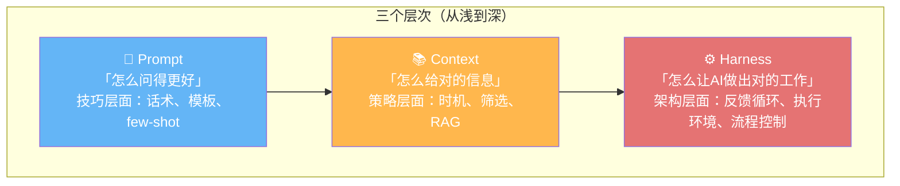

# Harness 概念理解

> 2026.06.07 学习记录

---

## 一、三层结构：Prompt → Context → Harness



| 层 | 解决的问题 | 类比 |
|----|----------|------|
| Prompt | "我问得够清楚吗" | 对服务员说"我要一杯不加糖的拿铁"而不是"给我喝的" |
| Context | "我给的信息够用吗" | 告诉医生症状、病史、过敏史——不多不少，刚好做判断 |
| Harness | "AI做偏了，我怎么纠正它" | 教练不只给训练计划，还要在运动员跑偏时喊停、纠姿势、再跑 |

**一句话**：Prompt 管输入质量，Context 管信息供给，Harness 管执行循环——在 Agent 每次输出后给出独立反馈，让它在循环中不断修正方向。

---

## 二、巴甫洛夫类比：条件反射与反馈循环

| 巴甫洛夫实验 | Harness 中的对应 |
|-------------|-----------------|
| 🔔 铃声 | Agent 的输出（生成的代码、分类结果） |
| 🥩 食物 | 目标 / 正确答案 |
| 👨‍🔬 实验员观察狗的反应 | Harness 评估 Agent 的输出 |
| ✅ 给食物（正向反馈） | "这个方向对，继续" |
| ❌ 不给食物（负向反馈） | "这个方向错，调整" |
| 🔄 反复刺激+反馈→建立反射 | 反复循环→Agent 学会在什么场景下输出什么 |

**关键差异**：巴甫洛夫的狗是被动的（不需要理解为什么），而 Harness 给的反馈是**独立的、结构化的判断**——不靠 Agent 自己反思，靠外部规则纠正。

---

## 三、延伸：CNN 训练与 Harness 循环的对应

```
CNN 训练：                      Harness 循环：
输入图片                        输入任务
   ↓                              ↓
前向传播 → 输出预测              Agent 执行 → 输出结果
   ↓                              ↓
损失函数计算误差                  Harness 独立评估结果
   ↓                              ↓
反向传播 → 调整权重              反馈 → 调整Agent行为
   ↓                              ↓
下一轮epoch → 误差减小           下一轮循环 → 结果更准
```

共同点：都是 **「输出 → 独立评估 → 反馈信号 → 调整 → 重新输出」** 的循环结构。

### 差异

| | CNN 权重调整 | Harness 反馈调整 |
|------|------------|-----------------|
| 调整对象 | 数学参数（浮点数） | Agent 行为策略（语义层面） |
| 反馈信号 | 梯度（精确数学值） | 规则判断 / 评分 / 自然语言 |
| 调整方式 | 反向传播（自动） | 重新生成 / 换工具 / 切换策略 |

---

---

## 五、可以关联的知识点

| 知识点 | 怎么关联 |
|--------|---------|
| **CNN 反向传播** | 数学层面：梯度下降 = 最朴素的「评估→调整」循环 |
| **PID 控制器** | 工程层面：设定值 - 实际值 = 误差 → 调整输出（和 Harness 反馈完全一致） |
| **强化学习** | AI 层面：Agent → 环境给 reward → Agent 调整策略（Harness 就是强化学习在工程上的实用化） |
| **你的 Spark 管道** | 实践层面：清晰度过滤 → 看到最低分图片 → 决定阈值 → 调整过滤策略，这也是一种"人肉 Harness" |

---

> 💡 记忆线索：**Prompt = 怎么问 · Context = 给什么 · Harness = 怎么纠**。纠的本质就是「独立判断 + 循环反馈」，跟训狗、训 CNN、调 PID 都是同一个底层结构。
