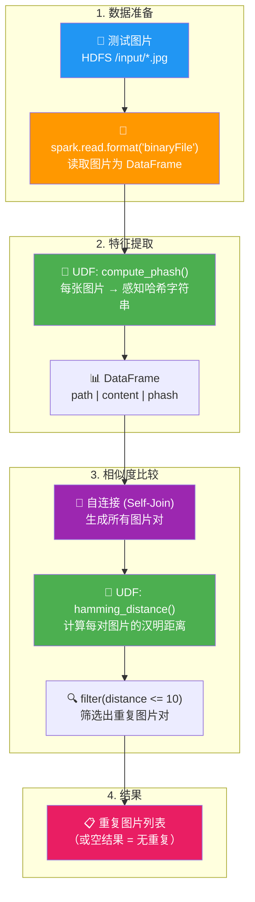
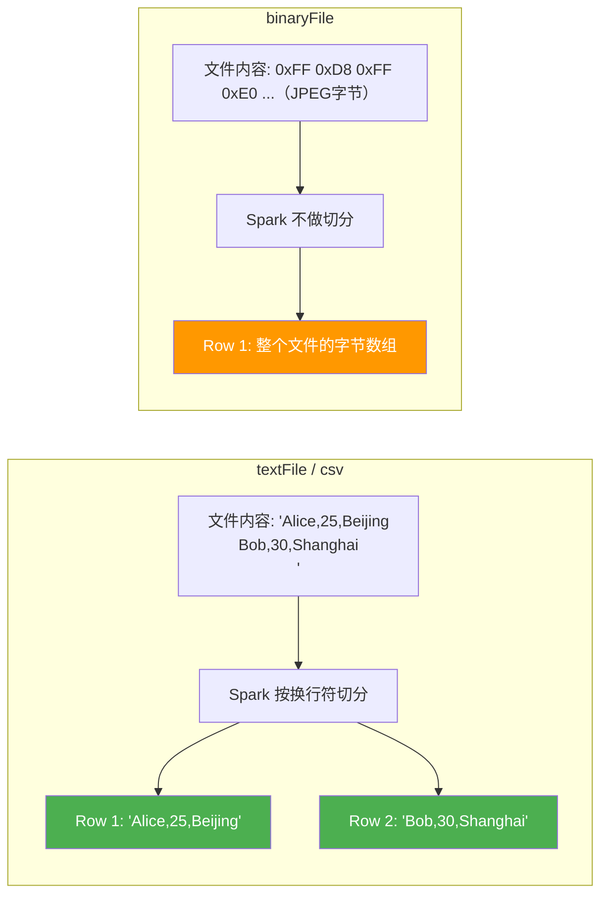
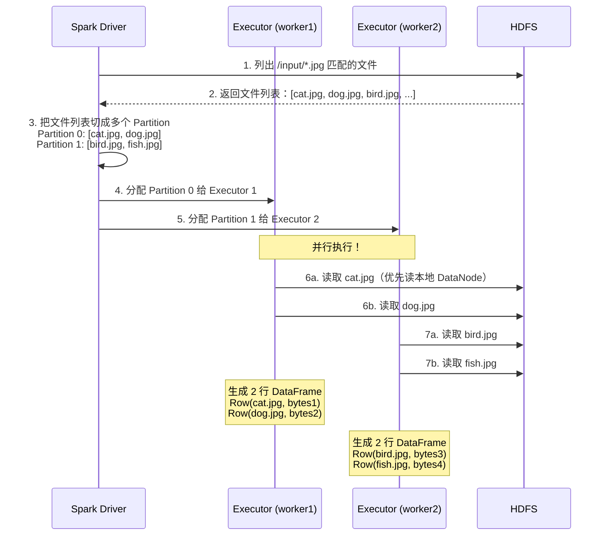
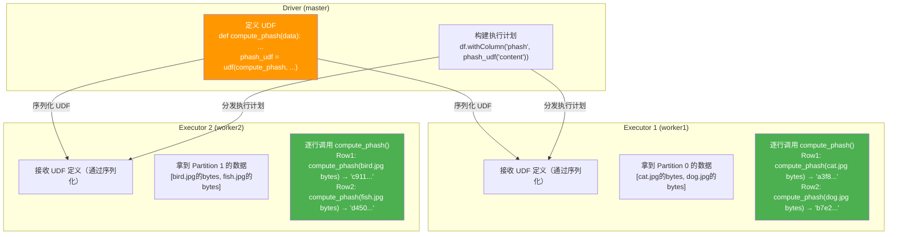
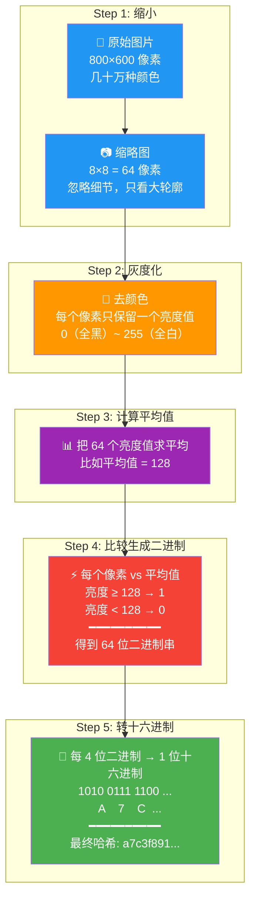
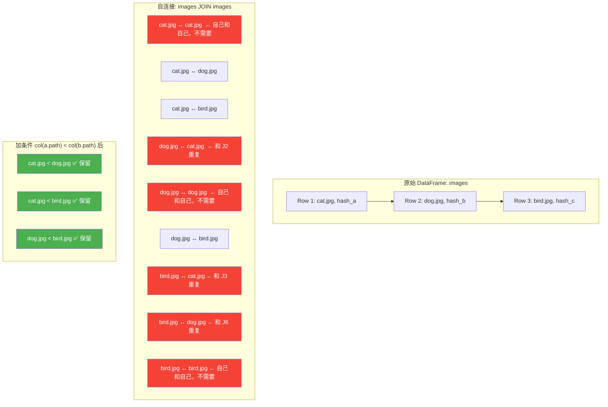
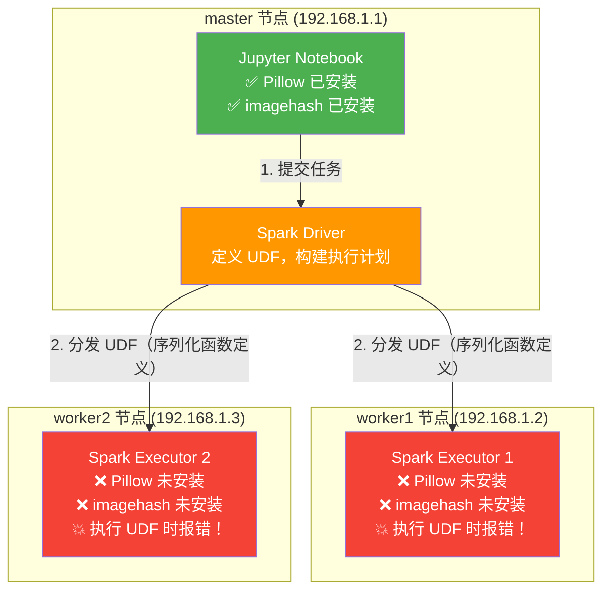
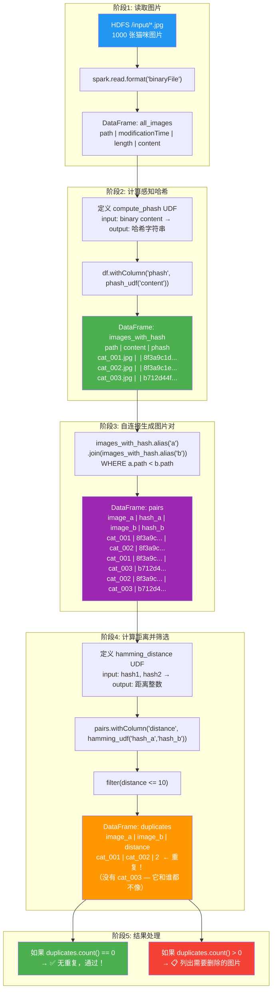
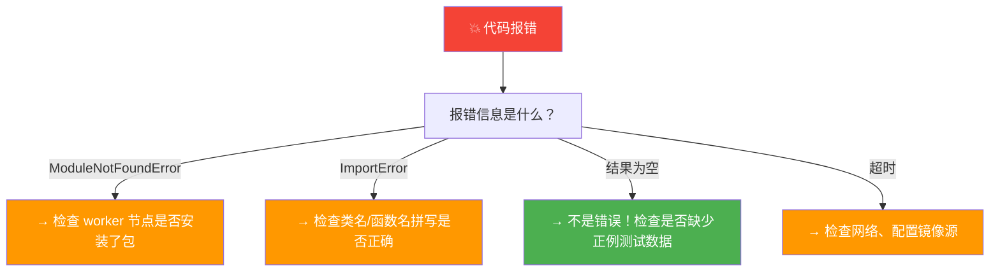
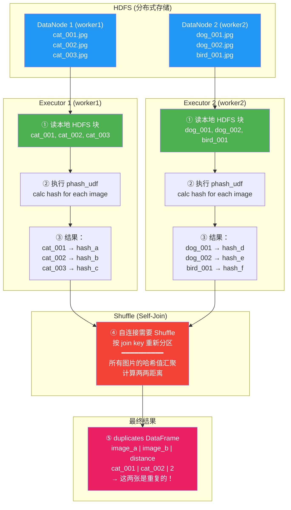

# W3 周三学习总结：图片读取与感知哈希去重（扩充版）

---

## 先看全景：今天干了什么，数据怎么流动的？



---

## 一、`binaryFile` 数据源 —— Spark 怎么"看懂"图片？

### 1.1 通俗理解：Spark 读文件有两种"模式"

你之前读 CSV 用的 `spark.read.csv()`，Spark 知道里面是文本，会自动按行切分、按逗号解析列。但图片不是文本——它是一串二进制字节，Spark 不能按"行"来理解它，需要一个专门的读取方式，这就是 `binaryFile`。

**打个比方**：
- `spark.read.csv()` 像是在读一本书，Spark 能看懂每一个字、每一句话
- `spark.read.format("binaryFile")` 像是在搬运一个密封的箱子，Spark 不知道箱子里是什么，但它知道箱子的大小、标签（路径），以及箱子本身（字节内容），原封不动地交给你

### 1.2 `binaryFile` 返回的 DataFrame 结构

当你执行 `spark.read.format("binaryFile").load("/path/*.jpg")`，Spark 会扫描 `/path/` 下所有 `.jpg` 文件，每个文件变成 DataFrame 中的**一行**：

| 列名 | 类型 | 含义 | 举例 |
|------|------|------|------|
| `path` | String | 文件在 HDFS 上的完整路径 | `hdfs://master:9000/user/root/image-pipeline/input/cat.jpg` |
| `modificationTime` | Timestamp | 文件最后修改时间 | `2026-05-27 10:30:00` |
| `length` | Long | 文件大小（字节数） | `245760`（约 240KB） |
| `content` | Binary | 文件的原始字节内容 | `<二进制数据，无法直接打印>` |

**关键认知**：
- `content` 列存的是**原始字节**，不是图片对象。你无法直接对它做 `show()` 看到图片内容——它就是一串 0 和 1。
- 你需要在 UDF 里用 Pillow 库把这串字节"翻译"成图片对象，然后才能做后续操作（计算哈希、判断清晰度等）。
- 每个文件是一行，所以如果你有 1000 张图片，DataFrame 就有 1000 行。

### 1.3 通配符读取

```python
# 读取目录下所有 .jpg 文件
df = spark.read.format("binaryFile").load("/user/root/image-pipeline/input/*.jpg")

# 读取所有 png 文件
df = spark.read.format("binaryFile").load("/user/root/image-pipeline/input/*.png")

# 读取所有图片（jpg + png）
df = spark.read.format("binaryFile").load("/user/root/image-pipeline/input/*.{jpg,png}")
```

Spark 会自动展开通配符，把匹配到的所有文件都读进来。这在处理海量图片时非常方便——不需要手动遍历文件列表。

### 1.4 `binaryFile` 和 `textFile`、`csv` 的本质区别



**核心区别**：
- 文本类数据源（csv, json, text）→ Spark 帮你**解析**文件内容，拆成行和列
- `binaryFile` → Spark **不解析**，原封不动把整个文件作为一行给你

### 1.5 扩展：`binaryFile` 底层是怎么工作的？



> **关键点**："`binaryFile` 数据源让 Spark 能够处理图片、PDF、音频等二进制文件。每个文件作为 DataFrame 的一行，包含 path、length、content 等列。文件被分布式地分配给不同 Executor 并行读取，利用 HDFS 的数据本地性实现高效 IO。"

---

## 二、UDF（User-Defined Function）—— 你教 Spark 做它不会的事

### 2.1 通俗理解：UDF 就是给 Spark "装一个插件"

Spark 内置了很多函数：`filter`（筛选）、`groupBy`（分组）、`sum`（求和）……但它不认识"图片"，不知道怎么从一堆字节里算出"感知哈希"。这时候你需要自己写一个 Python 函数，然后"注册"给 Spark，告诉它："嘿，以后遇到 `content` 列，就用我这个函数处理。"

这个"注册过程"就是 UDF（User-Defined Function，用户自定义函数）。

**打个比方**：
- Spark 内置函数 = 手机自带的 App（相机、日历、计算器）
- UDF = 你自己去应用商店下载安装的 App（美图秀秀、Snapseed）

### 2.2 UDF 是怎么定义和注册的？逐行拆解

```python
# 第1步：写一个普通的 Python 函数
#          ↓ 输入是一个 bytes 对象（图片的原始字节）
def compute_phash(binary_data):
    # 把 bytes 转成"内存中的图片对象"（就像把压缩包解压）
    from PIL import Image
    import io
    img = Image.open(io.BytesIO(binary_data))

    # 用 imagehash 库计算感知哈希
    import imagehash
    phash_value = imagehash.phash(img)

    # 转成字符串返回（因为 Spark 不认识 imagehash 的自定义类型）
    return str(phash_value)

# 第2步：把普通函数"注册"为 UDF
#        ↓ 第一个参数：你的函数名
#        ↓ 第二个参数：返回值类型（必须告诉 Spark！）
from pyspark.sql.functions import udf
from pyspark.sql.types import StringType

phash_udf = udf(compute_phash, StringType())
#          ↑                ↑
#    告诉 Spark：      输出是字符串类型
#    "这是我们要执行的函数"

# 第3步：在 DataFrame 上使用 UDF
df_with_hash = df.withColumn("phash", phash_udf("content"))
#                             ↑          ↑          ↑
#                          新列的名字    UDF函数    输入列的名字
```

**`withColumn` 做了什么？**
- 遍历 DataFrame 的每一行
- 取出 `content` 列的值（就是图片的原始字节）
- 把这个值传给 `phash_udf`（也就是 `compute_phash` 函数）
- 把函数返回的结果放到新列 `phash` 里
- 返回一个新的 DataFrame（原来的 DataFrame 不变）

### 2.3 UDF 在分布式环境下是怎么执行的？

这是理解 UDF 最关键的一点——你的 `compute_phash` 函数不是只在 master 上跑一次，而是被分发到每个 Executor 上，在**各自的数据分区上并行执行**。



**关键认知**：
- UDF 函数在 Driver 上定义，但**实际执行在 Executor 上**
- Spark 会通过序列化把函数"传送"到每个 Executor
- 每个 Executor 在自己的数据分区上**独立、并行**地调用这个函数
- 数据不需要集中到 Driver，这就是分布式计算的优势

### 2.4 UDF 的两个关键限制

| 限制 | 说明 | 影响 |
|------|------|------|
| **序列化要求** | UDF 函数必须能被 Python 序列化（pickle） | 函数内不能引用外部不可序列化的对象 |
| **返回值类型必须声明** | `udf(func, StringType())` 的第二个参数必须明确 | Spark 需要知道列的类型才能做后续优化 |

### 2.5 扩展：UDF vs Pandas UDF（Vectorized UDF）

这是扩展。PySpark 有两种 UDF：

| 对比维度 | 普通 UDF | Pandas UDF (Vectorized) |
|----------|----------|------------------------|
| **处理方式** | 逐行处理（一次一行） | 批量处理（一次一个 Pandas Series） |
| **性能** | 慢（Python 解释器开销 × 行数） | 快（利用 Pandas 向量化运算 + Arrow 序列化） |
| **定义方式** | `udf(func, ReturnType())` | `@pandas_udf(ReturnType())` 装饰器 |
| **适用场景** | 逻辑简单、数据量小 | 逻辑复杂、数据量大（**你的图片处理场景推荐用这个**） |

**普通 UDF（逐行）**：
```python
@udf(returnType=StringType())
def compute_phash_row_by_row(content):
    img = Image.open(io.BytesIO(content))  # 每行都要执行一次 Python 函数调用
    return str(imagehash.phash(img))
```

**Pandas UDF（批量）**：
```python
@pandas_udf(returnType=StringType())
def compute_phash_batch(content_series):
    # content_series 是一个 Pandas Series，包含一批图片的字节数据
    import pandas as pd
    def calc_single(bs):
        img = Image.open(io.BytesIO(bs))
        return str(imagehash.phash(img))
    return content_series.apply(calc_single)
```

> **关键点**："UDF 让 Spark 能执行自定义的 Python 逻辑，解决了内置函数无法处理非结构化数据（如图片）的问题。对于计算密集型 UDF，推荐使用 Pandas UDF（Vectorized UDF），它利用 Apache Arrow 进行高效序列化和批量处理，性能比普通 UDF 高 3~100 倍。"

---

## 三、感知哈希（Perceptual Hash, pHash）—— 图片的"指纹"

### 3.1 通俗理解：为什么不能用 MD5？

假设你有一张猫咪照片 `cat.jpg`：
- **普通哈希（MD5 / SHA-256）**：哪怕你只改了图片的 1 个像素，哈希值就完全不同。就像你对着一篇文章改了一个标点符号，MD5 就会给你一个全新的哈希，它"不认识"这两张图其实几乎一样。
- **感知哈希（pHash）**：你改几个像素、调一下亮度、稍微裁剪一下，哈希值只是微微变化，两张视觉上相似的图片，哈希值**很接近**。它"感知"到了图片的内容，而不是盯着每一个像素。

```
同一张图片的两种处理：

原始图片 cat.jpg
    → MD5:  a1b2c3d4e5f6...
    → pHash: 8f3a9c1d2e4b...

把 cat.jpg 缩小 1%（肉眼完全看不出来）
    → MD5:  z9y8x7w6v5u4...  ← 和上面完全不同！
    → pHash: 8f3a9c1d2e4c...  ← 和上面几乎一样（差1位）

结论：MD5 判断"文件是否一模一样"，pHash 判断"图片内容是否看起来一样"
```

### 3.2 感知哈希是怎么算出来的？逐步拆解

感知哈希的核心思想是：**把图片缩小到很小，忽略细节，只看整体亮暗分布**。

```
原始图片（假设 800×600 像素）
    ↓
第1步：缩小到 8×8 像素（共 64 个像素）
    ↓
第2步：转成灰度图（去掉颜色信息，只保留亮度）
    ↓
第3步：计算这 64 个像素的平均亮度
    ↓
第4步：每个像素和平均值比较
       比平均值亮 → 记为 1
       比平均值暗 → 记为 0
    ↓
第5步：得到 64 位的二进制串
       例如：10110101 00111010 ...
    ↓
第6步：转为十六进制字符串（方便存储和阅读）
       例如：8f3a9c1d2e4b5678
```

### 3.3 图解：从图片到哈希



### 3.4 图解：为什么缩小到 8×8 就能"感知"相似？

#### Step 0：先理解"缩小"到底发生了什么

假设原始图片是 900×600 像素（共 54 万个像素），把它缩小到 3×3 像素，意味着把整张图**强制压缩成只有 9 个格子**。这 9 个格子里的每个数值，是原图中**对应那一大片区域**所有像素的亮度平均值。

```
原始图片（900×600 像素）              缩小后（3×3 像素）
┌─────────────────────────────┐      ┌───────┬───────┬───────┐
│ 🟡🟡🟡🟡🟡 │ 🟡🟡🟡🟡🟡 │ 🌤️🌤️🌤️🌤️🌤️ │      │       │       │       │
│ 🟡🟡🟡🟡🟡 │ 🟡🟡🟡🟡🟡 │ 🌤️🌤️🌤️🌤️🌤️ │      │ 180   │ 175   │ 190   │  ← 天空区域平均亮度
│ 🟡🟡🐱🐱🟡 │ 🟡🐱🐱🐱🟡 │ 🌤️🌤️☁️🌤️🌤️ │      │       │       │       │
│             │             │             │  →   ├───────┼───────┼───────┤
│ 🟡🐱🐱🐱🐱 │ 🐱🐱🐱🐱🐱 │ 🟡🐱🐱🐱🐱 │      │       │       │       │
│ 🟡🐱🐱🐱🐱 │ 🐱🐱🐱🐱🐱 │ 🐱🐱🐱🐱🐱 │      │ 170   │ 120   │ 185   │  ← 猫的身体区域
│             │             │             │      │       │       │       │
│ 🌿🌿🌿🌿🌿 │ 🌿🌿🐱🐱🌿 │ 🌿🌿🌿🌿🌿 │      ├───────┼───────┼───────┤
│ 🌿🌿🌿🌿🌿 │ 🌿🌿🌿🌿🌿 │ 🌿🌿🌿🌿🌿 │      │       │       │       │
│ 🌿🌿🌿🌿🌿 │ 🌿🌿🌿🌿🌿 │ 🌿🌿🌿🌿🌿 │      │ 160   │ 150   │ 200   │  ← 草地/地面区域
└─────────────────────────────┘      └───────┴───────┴───────┘
     ↑ 每个 emoji 代表原图                           ↑ 每个数字代表那一大块
       中的几万个像素                                    的平均亮度
```

**关键认知**：缩小后的 9 个数字，不是 9 个像素，而是 9 个"区域亮度摘要"。左上角 180 告诉你"天空很亮"，中间 120 告诉你"猫的身体区域偏暗"，这就是所谓的**亮暗分布模式**。

> **类比**：就像你眯着眼睛看一张照片——你分不清猫的胡须有几根，但你一眼就能看出"上方亮、中间有个暗影、下方也比较暗"。pHash 就是把你"眯眼看到的亮暗印象"编码成数字。

---

#### Step 1：看具体例子——猫的照片（白天）

```
缩小后的 3×3 亮度矩阵：
┌─────┬─────┬─────┐
│ 180 │ 175 │ 190 │    ← 天空区域：都很亮（接近 255）
├─────┼─────┼─────┤
│ 170 │ 120 │ 185 │    ← 中间：120 偏暗（猫的身体挡住光线）
├─────┼─────┼─────┤
│ 160 │ 150 │ 200 │    ← 下方：偏亮（草地/地面）
└─────┴─────┴─────┘

计算平均值：(180+175+190+170+120+185+160+150+200) / 9 ≈ 170

每个格子和平均值 170 比较：
  180 ≥ 170 → 1    175 ≥ 170 → 1    190 ≥ 170 → 1
  170 ≥ 170 → 1    120 < 170 → 0    185 ≥ 170 → 1
  160 < 170 → 0    150 < 170 → 0    200 ≥ 170 → 1

      1  1  1
      1  0  1    ← 这就是这张图的"亮暗指纹"！
      0  0  1

二进制串：111 101 001
转十六进制：1E9
```

注意到这个指纹的含义了吗？
- **四个角 + 右边** 都是 1（亮）→ 符合"白天天空"的特征
- **中间偏下** 是 0（暗）→ 是猫身体所在的位置
- 这个 1/0 分布就是这张图的"身份签名"

---

#### Step 2：同一张猫，把亮度调高 5%

```
亮度调高 5% 后的 3×3 矩阵：
┌─────┬─────┬─────┐
│ 189 │ 184 │ 199 │    ← 所有数值都变大了 5%
├─────┼─────┼─────┤
│ 179 │ 126 │ 194 │
├─────┼─────┼─────┤
│ 168 │ 158 │ 200 │
└─────┴─────┴─────┘

平均值 ≈ 177（也比之前的 170 大了 5%）

但每个格子和新平均值 177 比较：
  189 ≥ 177 → 1    184 ≥ 177 → 1    199 ≥ 177 → 1
  179 ≥ 177 → 1    126 < 177 → 0    194 ≥ 177 → 1
  168 < 177 → 0    158 < 177 → 0    200 ≥ 177 → 1

      1  1  1
      1  0  1    ← 指纹和调亮前一模一样！🎉
      0  0  1
```

**这就是 pHash 的核心魔法**：虽然每个数值都变大了，但平均值也跟着变大了，所以**谁比平均值亮、谁比平均值暗**这个相对关系没有变。9 个格子中，中间那格始终是最暗的（猫身体），无论整体亮度怎么调。

---

#### Step 3：换一张完全不同的图片（狗的照片，夜景）

```
夜景狗照片缩小后的 3×3 矩阵：
┌─────┬─────┬─────┐
│ 30  │ 45  │ 25  │    ← 全部偏暗（夜景，都在 100 以下）
├─────┼─────┼─────┤
│ 20  │ 80  │ 35  │
├─────┼─────┼─────┤
│ 40  │ 50  │ 30  │
└─────┴─────┴─────┘

平均值 ≈ 39

和平均值比较后 → 指纹和猫图完全不同
```

| | 猫图 A | 猫图 B（调亮后） | 狗图 C |
|------|------|------|------|
| **指纹** | `111 101 001` | `111 101 001` | `010 110 101`（举例） |
| **与 A 的汉明距离** | 0 | 0 | 很大（> 5） |
| **结论** | 基准 | ✅ 和 A 重复 | ❌ 不同图片 |

---

#### 回到 8×8：为什么选这个尺寸？

实际 pHash 用的是 8×8 = 64 位，而不是 3×3 = 9 位：

- **3×3（9 位）**：太粗糙，不同图片碰巧生成相同指纹的概率很高
- **8×8（64 位）**：足够区分海量图片（2⁶⁴ ≈ 1844 亿亿种组合），同时保持对缩放/压缩/调色的鲁棒性
- **16×16（256 位）**：更精确，但对轻微变化的容忍度下降，相似的图片可能被判为不同

8×8 是实践中公认的"甜点"——既能区分不同图片，又能容忍同一图片的轻微变体。

> **一句话总结**：pHash 不关心每个像素的精确数值，只关心"哪个区域亮、哪个区域暗"这个相对格局。轻微编辑（调亮度、压缩、缩放）不会改变格局，所以哈希值相近；不同内容的图片格局不同，所以哈希值差很多。

### 3.5 代码实现详解

```python
import imagehash
from PIL import Image
import io

def compute_phash(binary_data):
    """
    输入: binary_data — 图片的原始字节（JPEG/PNG 编码）
    输出: 十六进制哈希字符串，如 '8f3a9c1d2e4b5678'
    """
    # Step 1: Bytes → 图片对象
    # io.BytesIO 把 bytes 包装成"伪文件"，让 Pillow 可以像读文件一样读它
    img = Image.open(io.BytesIO(binary_data))

    # Step 2: 计算感知哈希
    # imagehash.phash() 内部自动做了：缩小 → 灰度 → 比较 → 编码
    phash_value = imagehash.phash(img)

    # Step 3: 转字符串返回
    # phash_value 是 imagehash.ImageHash 对象，不能直接存到 DataFrame 里
    # str() 把它转成 '8f3a9c1d2e4b5678' 这样的十六进制字符串
    return str(phash_value)
```

**为什么要用 `io.BytesIO`？**
- `Image.open()` 期望接收一个文件路径或文件对象
- 图片的字节在内存中（DataFrame 的 content 列），不是磁盘上的文件
- `io.BytesIO(binary_data)` 创建一个"内存中的虚拟文件"，Pillow 可以像读磁盘文件一样读它

### 3.6 扩展：三种常见感知哈希的对比

| 哈希类型 | 全称 | 原理 | 特点 | 适用场景 |
|----------|------|------|------|----------|
| **pHash** | Perceptual Hash | 基于频域（DCT 变换） | 对缩放、压缩鲁棒 | 检测压缩/缩放的重复图片（**你的项目用这个**） |
| **aHash** | Average Hash | 基于像素平均值 | 最快，但对缩放敏感 | 快速初筛 |
| **dHash** | Difference Hash | 基于相邻像素差值 | 对亮度变化鲁棒 | 检测调过亮度的重复图片 |

> **关键点**："感知哈希通过缩小图片、提取亮暗分布特征来生成图片指纹。我选用 pHash（基于 DCT 变换），因为它对 JPEG 压缩和轻微缩放有很好的鲁棒性，不会像 MD5 那样因为一个字节的差异就判定为不同图片。"

---

## 四、汉明距离（Hamming Distance）—— 量一下两张图"差多少"

### 4.1 通俗理解：数一数有几个位置不一样

汉明距离的算法极其简单：把两个等长的字符串对齐，然后**逐位比较，数有几个位置不同**。

```
哈希A: 8f3a9c1d2e4b5678
哈希B: 8f3a9c1d2e4b5678
       逐位比较 ↓
       全 部 相 同！
汉明距离 = 0 → 两张图一模一样

━━━━━━━━━━━━━━━━━━━━━━━━━━━━━━━

哈希A: 8f3a9c1d2e4b5678
哈希B: 8f3a9c1d2e4b5222
       逐位比较 ↓
                ↑      ↑  ↑
            第14位  第15位  第16位 不同
汉明距离 = 3 → 两张图很相似（可能是轻微编辑过）

━━━━━━━━━━━━━━━━━━━━━━━━━━━━━━━

哈希A: 8f3a9c1d2e4b5678
哈希B: 1234567890abcdef
       逐位比较 ↓
       几乎全部不同
汉明距离 ≈ 30+ → 两张图完全不同
```

### 4.2 感知哈希的汉明距离意味着什么？

感知哈希固定为 64 位，所以汉明距离的取值范围是 0 ~ 64：

| 汉明距离 | 含义 | 实际操作 |
|----------|------|----------|
| **0** | 完全相同（或极其微小的差异） | 可以安全删除其中一张 |
| **1 ~ 5** | 非常相似（同一个图的不同压缩/缩放版本） | 很可能重复，建议保留质量高的那张 |
| **6 ~ 10** | 比较相似（可能是同一场景的不同拍摄） | 需要人工判断 |
| **11 ~ 64** | 不相似 | 保留，不做处理 |

**你项目中选择的阈值是 10**，这是一个相对保守的选择——宁可多留几张，也不能误删不同的图片。

### 4.3 代码实现

```python
import imagehash

def hamming_distance(hash1_str, hash2_str):
    """
    输入: 两个十六进制哈希字符串
    输出: 汉明距离（整数，0~64）
    """
    # imagehash.hex_to_hash() 把十六进制字符串还原为 ImageHash 对象
    hash1 = imagehash.hex_to_hash(hash1_str)
    hash2 = imagehash.hex_to_hash(hash2_str)

    # ImageHash 对象重载了 - 运算符 = 计算汉明距离
    return hash1 - hash2
```

**`imagehash` 库的设计**：`ImageHash` 对象重载了 `-` 运算符，直接相减就能得到汉明距离。这比手动逐位比较高效得多——库底层用 C 实现了位运算。

### 4.4 自己手动计算汉明距离（帮助理解原理）

```python
def hamming_distance_manual(hash1_str, hash2_str):
    """
    手动实现，帮助理解——实际项目中直接用 imagehash 库的 -
    """
    # 十六进制 → 二进制整数
    hash1_int = int(hash1_str, 16)
    hash2_int = int(hash2_str, 16)

    # XOR（异或）：相同位→0，不同位→1
    xor_result = hash1_int ^ hash2_int

    # 数一下 XOR 结果中有多少个 1
    distance = bin(xor_result).count('1')

    return distance

# 示例
# hash1 = '8f' → 二进制 1000 1111
# hash2 = '8e' → 二进制 1000 1110
# XOR 结果    → 二进制 0000 0001 （只有 1 个 1）
# 汉明距离 = 1
```

---

## 五、自连接（Self-Join）—— 让每张图和所有其他图"见面"

### 5.1 通俗理解：为什么需要自连接？

你有 1000 张图片，要去重，就必须考察**每一对**图片是否相似。也就是说，你需要把 1000 张图片的所有两两组合都列出来。

就像在一个班级里，你要找出所有"身高差不超过 2cm"的人对——你需要让每个同学和全班其他同学都报一下身高差。自连接就是做这件事。



### 5.2 自连接的两个关键技巧

**技巧1：`col("a.path") < col("b.path")`**

自连接会产生 N×N 行（如 1000 张图 = 1,000,000 对），其中大量是冗余的：
- 自己和自己配对（cat vs cat）→ 没用，汉明距离永远是 0
- 重复配对（cat vs dog 和 dog vs cat）→ 同一对图片，不需要比较两次

`col("a.path") < col("b.path")` 一次性解决这两个问题：
- `a.path < b.path` 不会等于自己（因为 `"cat" < "cat"` 是 False）
- 按字符串排序后，每对只保留一个方向（cat < dog 是 True，dog < cat 是 False）

**技巧2：为什么要 `alias("a")` 和 `alias("b")`？**

```python
images_with_hash.alias("a").join(
    images_with_hash.alias("b"),
    col("a.path") < col("b.path")
)
```

自连接时，DataFrame 和自己 JOIN，列名会重复。`alias("a")` 给左边起个别名叫 "a"，`alias("b")` 给右边起个别名叫 "b"。之后用 `col("a.path")` 和 `col("b.phash")` 就能区分左右两边的列。

### 5.3 完整自连接去重代码

```python
from pyspark.sql.functions import col

# Step 1: 自连接，生成所有图片对
pairs = (
    images_with_hash.alias("a")
    .join(
        images_with_hash.alias("b"),
        col("a.path") < col("b.path")  # 只保留 a.path < b.path 的对
    )
    .select(
        col("a.path").alias("image_a"),
        col("a.phash").alias("hash_a"),
        col("b.path").alias("image_b"),
        col("b.phash").alias("hash_b"),
    )
)

# Step 2: 计算汉明距离
pairs_with_distance = pairs.withColumn(
    "distance",
    hamming_udf(col("hash_a"), col("hash_b"))
)

# Step 3: 筛选出重复对（距离 ≤ 10）
duplicates = pairs_with_distance.filter(col("distance") <= 10)

# Step 4: 查看结果
duplicates.show()
```

### 5.4 自连接的性能注意事项

自连接会产生 **C(N, 2)** 行数据，即 N×(N-1)/2：
- 1000 张图片 → 约 50 万对 → 可以接受
- 10000 张图片 → 约 5000 万对 → 开始吃力
- 100000 张图片 → 约 50 亿对 → 需要优化（分桶、LSH 等）

**后续优化方向**：
- **分桶（Bucketing）**：按哈希前缀预分组，只比较同一桶内的图片
- **LSH（Locality Sensitive Hashing）**：局部敏感哈希，一种近似最近邻搜索算法

> **关键点**："自连接是去重场景中生成图片对的常用方法。`col('a.path') < col('b.path')` 确保无重复对、无自配对。对于海量图片，自连接的 O(N²) 复杂度会成为瓶颈，后续可以考虑用 LSH（局部敏感哈希）对相似图片进行分桶，只在桶内做精确比较。"

---

## 六、分布式环境下的依赖安装问题 —— 今天的"大坑"与解决

### 6.1 问题描述

你在 Jupyter（运行在 master 上）用 `pip install Pillow imagehash` 安装了库，代码在本地测试通过了。但是一旦把 UDF 提交到 Spark 集群跑，就报错：

```
ModuleNotFoundError: No module named 'PIL'
```

### 6.2 为什么会这样？

```
你的认知：
  "我在服务器上 pip install 了，应该就能用了啊"

实际情况：
  ┌─────────────────────────────────────────────────┐
  │  master 节点          │  worker1 节点           │
  │  ✅ Pillow 已安装      │  ❌ Pillow 没装          │
  │  ✅ imagehash 已安装   │  ❌ imagehash 没装       │
  │  ✅ Jupyter 跑在这里   │  💡 UDF 在这里执行       │
  │                         │  ← 报错！找不到 Pillow  │
  └─────────────────────────────────────────────────┘

原因：pip install 只装在当前机器上。UDF 实际在 worker 节点
      上执行，worker 上没有这些库，所以报错。
```



### 6.3 解决方案

**方案一（推荐）：在每个 worker 节点上安装**

```bash
# SSH 到每个 worker 节点
ssh worker1
pip install Pillow imagehash -i https://mirrors.aliyun.com/pypi/simple/

ssh worker2
pip install Pillow imagehash -i https://mirrors.aliyun.com/pypi/simple/
```

**方案二：在 UDF 函数内部动态导入**

```python
def compute_phash(binary_data):
    # 在函数内部 import，延迟到 Executor 上才执行
    # 前提是 worker 上已经装了这些包
    from PIL import Image
    import io
    import imagehash

    img = Image.open(io.BytesIO(binary_data))
    return str(imagehash.phash(img))
```

> **注意**：方案二只在每个 worker 节点**已安装**包但 Python 还没导入时有用。如果包根本没装，哪种方案都不行——必须先在 worker 上 pip install。

**方案三（生产环境推荐）：用集群管理工具批量安装**

```bash
# 如果用 Ansible
ansible workers -m pip -a "name=Pillow,imagehash state=present"

# 或者写一个批量脚本
for host in worker1 worker2; do
    ssh $host "pip install Pillow imagehash"
done
```

### 6.4 拓展：pip 镜像源配置

国内服务器访问 PyPI 官方源很慢，甚至可能超时。配置国内镜像源：

```bash
# 临时使用（单次 pip install 生效）
pip install Pillow -i https://mirrors.aliyun.com/pypi/simple/

# 永久配置（写入 pip 配置文件）
mkdir -p ~/.pip
cat > ~/.pip/pip.conf << 'EOF'
[global]
index-url = https://mirrors.aliyun.com/pypi/simple/
trusted-host = mirrors.aliyun.com
EOF
```

| 镜像源 | URL |
|--------|-----|
| 阿里云（推荐） | `https://mirrors.aliyun.com/pypi/simple/` |
| 清华 | `https://pypi.tuna.tsinghua.edu.cn/simple/` |
| 中科大 | `https://pypi.mirrors.ustc.edu.cn/simple/` |
| 华为云 | `https://repo.huaweicloud.com/repository/pypi/simple/` |

> **关键点**："UDF 在 Executor 上执行，因此 UDF 依赖的第三方库必须在**所有 worker 节点**上安装，不能只在 Driver 上安装。这是分布式环境下很容易忽略的问题，实际项目中要在集群初始化时就统一安装好运行环境。"

---

## 七、代码核心流程全景图

### 7.1 完整流程



### 7.2 完整可运行代码

```python
# ==========================================
# 图片感知哈希去重 - 完整代码
# ==========================================

from pyspark.sql import SparkSession
from pyspark.sql.functions import udf, col
from pyspark.sql.types import StringType, IntegerType
import io
from PIL import Image
import imagehash

# ── 第1步：创建 SparkSession ──
spark = SparkSession.builder \
    .appName("ImageDedup") \
    .master("yarn") \
    .getOrCreate()

# ── 第2步：读取所有图片 ──
all_images = spark.read \
    .format("binaryFile") \
    .load("/user/root/image-pipeline/input/*.jpg")

print(f"读取了 {all_images.count()} 张图片")
all_images.select("path", "length").show(5, truncate=False)

# ── 第3步：定义感知哈希 UDF ──
def compute_phash(binary_data):
    """输入：图片的原始字节，输出：十六进制哈希字符串"""
    img = Image.open(io.BytesIO(binary_data))
    return str(imagehash.phash(img))

phash_udf = udf(compute_phash, StringType())

# ── 第4步：计算每张图片的哈希 ──
images_with_hash = all_images.withColumn("phash", phash_udf("content"))
images_with_hash.select("path", "phash").show(5, truncate=False)

# ── 第5步：定义汉明距离 UDF ──
def hamming_distance(hash1, hash2):
    """输入：两个哈希字符串，输出：汉明距离（0~64）"""
    return imagehash.hex_to_hash(hash1) - imagehash.hex_to_hash(hash2)

hamming_udf = udf(hamming_distance, IntegerType())

# ── 第6步：自连接，找重复 ──
duplicates = (
    images_with_hash.alias("a")
    .join(
        images_with_hash.alias("b"),
        col("a.path") < col("b.path")   # 避免重复对和自己和自己
    )
    .select(
        col("a.path").alias("image_a"),
        col("a.phash").alias("hash_a"),
        col("b.path").alias("image_b"),
        col("b.phash").alias("hash_b"),
    )
    .withColumn("distance", hamming_udf(col("hash_a"), col("hash_b")))
    .filter(col("distance") <= 10)       # 阈值：≤10 判为重复
)

# ── 第7步：输出结果 ──
duplicate_count = duplicates.count()
print(f"发现 {duplicate_count} 对重复图片")

if duplicate_count > 0:
    duplicates.select("image_a", "image_b", "distance").show(truncate=False)
else:
    print("✅ 无重复图片，数据集去重通过！")
```

---

## 八、今天遇到的所有错误与根本原因分析

| 错误信息 | 表面原因 | 根本原因 | 解决方案 | 知识点 |
|----------|----------|----------|----------|--------|
| `ModuleNotFoundError: No module named 'PIL'` | 找不到 Pillow 库 | `pip install` 只装在 master 上，worker 节点没有 | 在所有 worker 上执行 `pip install Pillow` | **分布式环境下每个节点需要独立的运行环境** |
| `cannot import name 'IntType'` | 类型名写错 | PySpark 的类型类叫 `IntegerType`，不是 `IntType` | 改为 `from pyspark.sql.types import IntegerType` | PySpark SQL 类型命名规则 |
| 去重结果为空（count = 0） | 没有发现重复 | 随机下载的测试图片内容各不相同，哈希值不同 | 正常现象！人为上传几张相同的图片再跑一次验证 | **测试需要构造正例（确实重复的图片）来验证逻辑** |
| pip 下载慢/超时 | 默认从国外 PyPI 源下载 | 国内服务器到国外带宽有限 | 配置阿里云/清华 pip 镜像源 | pip 镜像源 `-i` 参数 |

### 8.1 为什么要"人为构造正例"？

```
去重结果为空 ≠ 代码写错了

你的测试图片是随机下载的，每张都不一样，pHash 自然不同，
汉明距离大，filter(distance <= 10) 筛不出来，结果为空。

这恰恰证明你的逻辑是对的——它没有"乱杀"不相似的图片。

但你要验证阈值设置是否合理、UDF 是否真的在跑，就需要：
  → 上传两张"几乎一样"的图片（比如同一张图的不同压缩质量）
  → 如果它们的 distance <= 10 → 验证通过 ✅
  → 如果 distance > 10 → 阈值可能需要调整
```

### 8.2 错误排查的通用思路



---

## 九、数据在集群中怎么流动的？—— 一张图看懂



> **重点观察**：自连接触发了 **Shuffle**！因为两张图片可能分布在不同的 Executor 上，必须通过网络把数据重新分区，让需要比较的图片对落到同一个 Executor 上。

---

## 十、知识点对照

| 今天学的内容 | 常见问题 | 回答要点 |
|-------------|---------------|----------|
| `binaryFile` 数据源 | "Spark 怎么读取图片等二进制文件？" | 每个文件一行，返回 path/length/content 列；通配符匹配；分布式并行读取 |
| UDF | "什么是 UDF？你写过什么 UDF？它和内置函数的区别？" | 自定义函数 + 注册 + 分布式执行；必须声明返回类型；我在图片去重项目里用它算感知哈希 |
| 感知哈希（pHash） | "图片去重你是怎么做的？为什么不用 MD5？" | MD5 是文件级哈希，一个像素不同就全不同；pHash 模拟人眼感知，相似图片哈希相近；算法流程：缩小→灰度→均值比较→编码 |
| 汉明距离 | "怎么判断两张图片相似？阈值怎么设？" | XOR 后数 1 的个数；64 位哈希距离范围 0~64；阈值 10 是保守选择，平衡召回率和精准率 |
| 分布式环境缺包 | "UDF 在 worker 上报错找不到模块怎么解决？" | `pip install` 只装在 master；需要在所有 worker 节点安装依赖；集群初始化时就统一配好运行环境 |
| 自连接 | "去重怎么避免重复比较和自己比自己？" | `alias("a").join(alias("b"), col("a.path") < col("b.path"))`；确保每对只出现一次，且不和自己比较 |
| 通配符读取 | "怎么一次性读 HDFS 上的所有图片？" | `load("/path/*.jpg")` 或 `*.{jpg,png}`；Spark 自动展开通配符 |
| **扩展考点** | | |
| 普通 UDF vs Pandas UDF | "UDF 性能怎么优化？" | Pandas UDF 批量处理 + Arrow 序列化，性能高 3~100 倍 |
| aHash / pHash / dHash | "感知哈希有几种？各有什么优缺点？" | aHash 最快但对缩放敏感；pHash 基于 DCT 变换，对压缩/缩放鲁棒；dHash 基于梯度，对亮度变化鲁棒 |
| O(N²) 优化 | "如果有 100 万张图片，自连接跑不动怎么办？" | LSH 分桶、先按哈希前缀分组做粗筛、用 KD-Tree / Ball-Tree 近似搜索 |

---

## 十一、今天学到的"大概念"总结

```
┌─────────────────────────────────────────────────────────────┐
│                    今天的知识体系                             │
│                                                             │
│  怎么读取图片？ ─────→ binaryFile 数据源                     │
│       ↓                                                     │
│  怎么处理图片？ ─────→ UDF（自定义函数）                     │
│       ↓                                                     │
│  怎么判断相似？ ─────→ 感知哈希（pHash）+ 汉明距离           │
│       ↓                                                     │
│  怎么找出重复？ ─────→ 自连接（Self-Join）                  │
│       ↓                                                     │
│  怎么确保可靠性？ ──→ 分布式依赖安装 + 正例测试              │
└─────────────────────────────────────────────────────────────┘
```

---

## 十二、明天（W3 周四）预告

| 主题 | 内容 | 与今天的关系 |
|------|------|-------------|
| **拉普拉斯方差（Laplacian Variance）** | 衡量图片清晰度/模糊度的指标 | 同为图片质量评估，和 pHash 一样用 UDF 计算 |
| **模糊图片过滤** | 计算每张图的清晰度评分，设阈值过滤 | 和去重一样是数据清洗的步骤 |
| **管道串联** | 清晰度过滤 → 感知哈希去重 → 输出干净数据集 | 把两个清洗步骤串联成一条流水线 |
| **新挑战** | Laplacian 算法涉及图像卷积/边缘检测 | 需要理解一点图像处理基础 |

---

*文档版本：扩充版 | 更新时间：2026-05-27 | 基于 W3 周三感知哈希去重学习内容扩充，新增图解、原理深入、核心考点和 Mermaid 流程图*
