# W3 周二前置知识完整版：PySpark DataFrame API 与分布式执行

---

## 一、SparkSession 是什么？

**通俗理解**：
SparkSession 是你和 Spark 集群之间的"对话窗口"。就像你要操作数据库需要先"连接数据库"一样，你要操作 Spark 集群，第一步就是创建一个 SparkSession。有了它，你才能读取数据、做计算、写结果。它就是你代码和分布式集群之间的翻译官。在 YARN 模式下，它会自动向 YARN ResourceManager 申请计算资源（CPU 和内存），并在多个节点上启动 Executor 来干活。

**关键配置参数解释**：

| 参数 | 含义 | 举例 |
|------|------|------|
| `appName` | 给这次任务起个名字 | `"DataFramePractice"`，方便在 YARN Web UI 里找到它 |
| `master` | 指定运行模式 | `"yarn"` 表示用 YARN 分布式调度；`"local[*]"` 则是单机模拟 |
| `config("spark.executor.memory", "2g")` | 每个 Executor 分配多少内存 | 这里分 2 GB，你的集群有 12 GB 总可用，所以能同时跑多个 Executor |
| `getOrCreate()` | 获取或创建 SparkSession | 如果有现成的就复用，没有就新建 |

### 扩展：Spark 支持的运行模式

| 模式 | `master` 参数 | 适用场景 |
|------|-------------|----------|
| **Local 模式** | `local[*]` | 本地开发/测试，单机模拟多线程 |
| **Standalone 模式** | `spark://host:port` | Spark 自带的集群管理器，中小规模 |
| **YARN 模式** | `yarn` | 与 Hadoop 生态集成，大规模生产环境（**你的项目用的就是这个**） |
| **Kubernetes 模式** | `k8s://host:port` | 云原生部署，容器化 Spark 任务 |
| **Mesos 模式** | `mesos://host:port` | 较少见，Apache Mesos 集群管理器 |

### 扩展：SparkSession 内部架构

**SparkSession 统一了旧版本中分散的入口**（Spark 2.0 之前需要分别创建 `SparkContext`、`SQLContext`、`HiveContext`）。

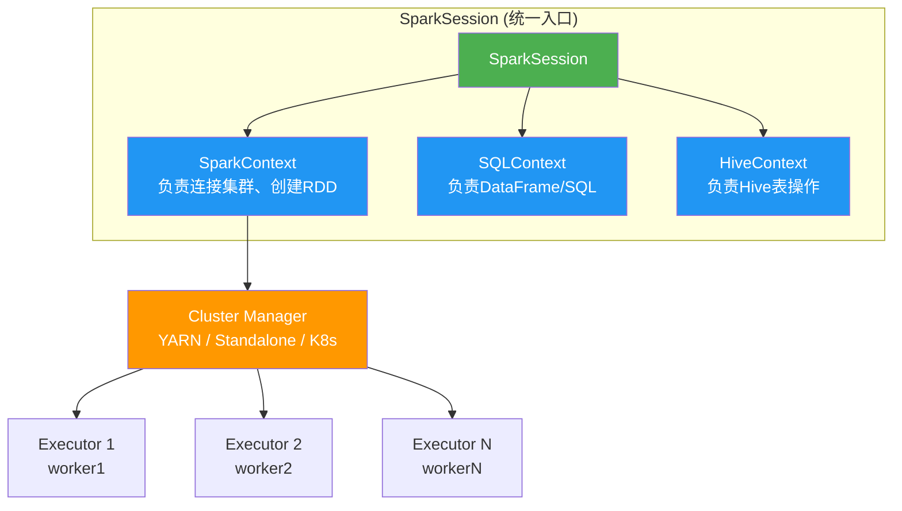

> **补充**：SparkSession 是 Spark 2.0+ 的统一入口，底层封装了 SparkContext（RDD 操作）和 SQLContext（DataFrame/SQL 操作）。`getOrCreate()` 是单例模式的体现——在一个 JVM 中只会存在一个 SparkSession/SparkContext。

---

## 二、DataFrame 是什么？

**通俗理解**：
DataFrame 是一张"分布式的大表格"。它和 Excel 表格、Pandas 的 DataFrame、数据库的表 非常相似：

- **有列名和类型**：比如 `name` 列是字符串，`age` 列是整数
- **有行**：每一行是一条记录
- **分布存储**：数据被切成很多块，分散在集群的多个节点上，而不是只在一台机器上

**和 RDD 的关系**：
- RDD（弹性分布式数据集）是 Spark 最底层的数据抽象，像"没有表头的表格"，只知道数据内容，不知道每列是什么类型
- DataFrame 是"带 Schema 的 RDD"，知道每列的名字和类型，这让 Spark 可以自动优化计算逻辑
- 现在 Spark 官方推荐优先用 DataFrame，因为性能更好、代码更简洁

**你今天的代码里**：读取 CSV 文件得到的 `df` 就是一个 DataFrame，它被 Spark 自动切成多块，分布在 worker1 和 worker2 上。

### 扩展：RDD vs DataFrame vs Dataset 三者对比

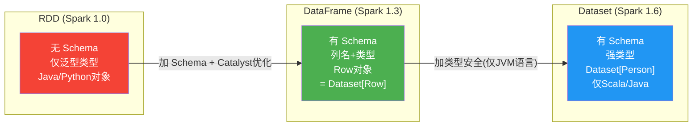

| 对比维度 | RDD | DataFrame | Dataset |
|----------|-----|-----------|---------|
| **Schema（表结构）** | 无 | 有，自动推断或手动定义 | 有，编译时确定 |
| **类型安全** | 编译时安全 | **运行时**才能发现类型错误 | **编译时**就能发现错误（仅JVM） |
| **性能优化** | 无，手动优化 | Catalyst 优化器 + Tungsten 内存管理 | 同 DataFrame |
| **序列化** | Java 序列化（慢） | Tungsten 高效序列化（快） | Encoder 编码（快） |
| **支持语言** | Scala, Java, Python, R | Scala, Java, Python, R | Scala, Java（PySpark 不支持） |
| **适合场景** | 非结构化数据、底层操作 | SQL 类操作、数据分析（**你的项目用这个**） | 需要类型安全的 ETL |
| **SQL 查询** | 不支持 | 可通过 `spark.sql()` 查询 | 通过 `spark.sql()` 或类型安全API |

> **关键点**："RDD 是底层抽象，DataFrame 是加了 Schema 的 RDD。DataFrame = Dataset[Row]。在 Python 中我们主要用 DataFrame，因为 Dataset 的强类型特性只在 JVM 语言中可用。Spark 官方推荐的优先级是 DataFrame > Dataset > RDD。"

### 扩展：Catalyst 优化器是如何工作的？

这是 Spark SQL 的核心——它把你的 DataFrame 操作变成高效执行计划的四大步骤：

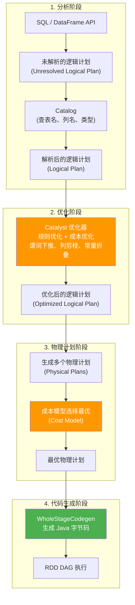

**四大核心优化策略**：

| 优化策略 | 含义 | 举例 |
|----------|------|------|
| **谓词下推** (Predicate Pushdown) | 把过滤条件推到数据源端执行 | `df.filter(col("age") > 18)` → Parquet 读取时只读 age>18 的行 |
| **列剪枝** (Column Pruning) | 只读取需要的列 | `df.select("name", "age")` → Parquet 只读 name 和 age 列，跳过其他 |
| **常量折叠** (Constant Folding) | 编译时计算常量表达式 | `1 + 2` → 直接替换为 `3` |
| **投影剪枝** (Projection Pruning) | 提早裁剪不需要的列 | 减少 shuffle 传输的数据量 |

---

## 三、HDFS 上的文件路径（详解）

### 3.1 本地文件系统和 HDFS 的本质区别

**本地文件系统**（就是你服务器上的 `/tmp/`、`/root/` 这些）：

- 文件实实在在地存在**这台机器的硬盘**上
- 你在 master 上创建的 `/tmp/users.csv`，只在 master 的硬盘上，worker1 和 worker2 根本看不到这个文件
- 如果 master 宕机了，文件就没了（除非有备份）

**HDFS**（Hadoop Distributed File System，Hadoop 分布式文件系统）：

- 文件被**切成小块**（默认每块 128 MB），分散存储在**多台机器的硬盘**上
- 每个块还有**多个副本**（默认 3 份），分布在不同节点上
- 任何一台机器宕机，数据不会丢，因为其他节点上还有副本

### 3.2 用你今天的例子来理解

你今天做了这件事：

```bash
# 1. 在 master 本地创建文件
cat > /tmp/users.csv  # 这个文件只在 master 的硬盘上

# 2. 上传到 HDFS
hdfs dfs -put /tmp/users.csv /user/root/image-pipeline/input/users.csv
```

**`hdfs dfs -put` 做了什么？**

1. 把 `/tmp/users.csv` 这个本地文件，读进内存
2. 切分成数据块（你这个文件只有 210 字节，远小于 128 MB，所以只占 1 个块）
3. 根据配置的副本数（你设的是 `dfs.replication=2`），把这个块的 2 份副本，分别存到 **两个不同的 DataNode** 上
4. 在 NameNode 里记录元数据："文件 `/user/root/image-pipeline/input/users.csv` 被切成 1 个块，第 1 个副本在 worker1，第 2 个副本在 worker2"

### 3.3 两种路径对比（非常重要）

| | 本地文件路径 | HDFS 文件路径 |
|------|------------|-------------|
| **长什么样** | `/tmp/users.csv` | `/user/root/image-pipeline/input/users.csv` |
| **数据在哪** | 只在当前这台机器的硬盘上 | 被切成块，分布在多个 DataNode 上 |
| **怎么访问** | 直接用 Linux 命令：`cat`、`ls`、`cp` | 用 HDFS 命令：`hdfs dfs -cat`、`hdfs dfs -ls`、`hdfs dfs -put` |
| **其他节点能看到吗** | ❌ 不能，只在当前机器 | ✅ 能，整个集群都能通过 HDFS 路径访问 |
| **机器宕机会丢吗** | ⚠️ 会丢（除非另有备份） | ✅ 不会，其他节点上有副本 |
| **Spark 能直接读吗** | ⚠️ 只能读本机的，分布式读不了 | ✅ 可以，Spark 的每个 Executor 能从自己本地的 DataNode 读数据，效率极高 |

### 扩展：HDFS 架构深度剖析

这里用几张图来重点讲清楚 HDFS 和 Spark 的关系。

#### 图1：HDFS 架构全景图

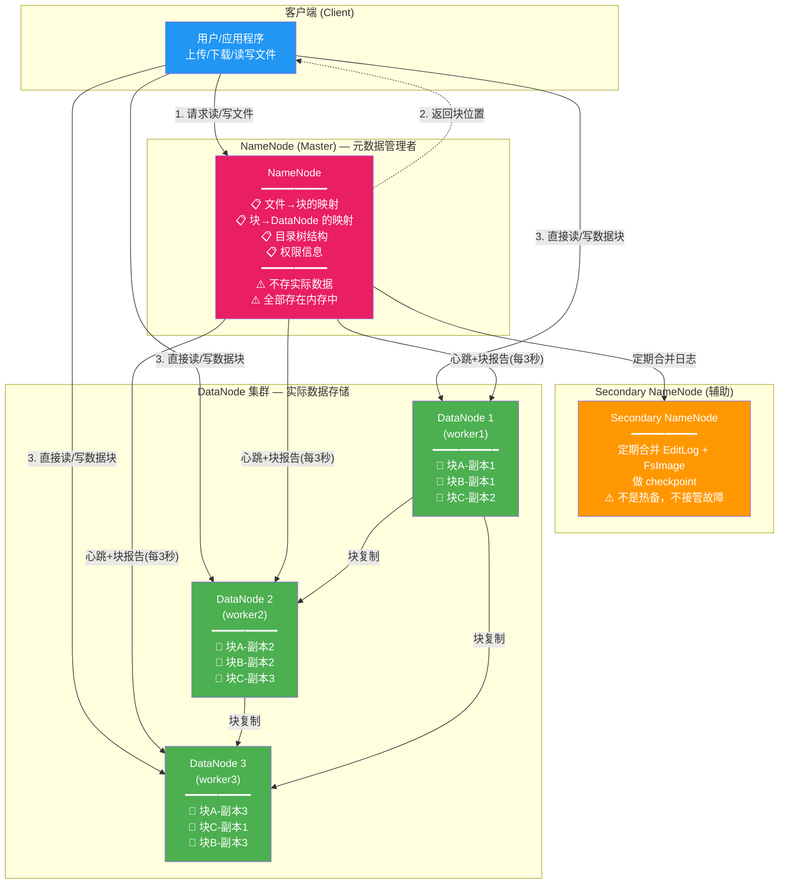

**HDFS 核心组件说明**：

| 组件 | 角色 | 存储内容 | 关键特性 |
|------|------|----------|----------|
| **NameNode** | Master（管理者） | 元数据（文件名、块映射、权限等） | 所有元数据在内存中，是 HDFS 的单点故障点 |
| **Secondary NameNode** | 辅助者 | 定期合并 EditLog 和 FsImage | 不是热备！不能代替 NameNode 做故障切换 |
| **DataNode** | Worker（干活的） | 实际的数据块 | 定期向 NameNode 发送心跳（默认3秒），报告自己存了哪些块 |

#### 图2：HDFS 写文件流程（重点）

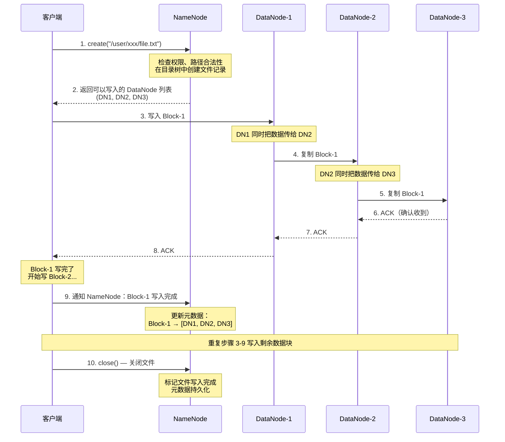

**关键设计原则**："流水线复制"（Pipeline Replication）
- 客户端只把数据发给第一个 DataNode，后续 DataNode 之间**链式转发**
- 假设有 3 个副本、文件 1GB、带宽 100MB/s：
  - **全部由客户端传**：客户端需要上传 1GB × 3 = 3GB，耗时 30 秒
  - **流水线复制**：客户端只需上传 1GB，耗时 10 秒（节点间用内网带宽，更快）
- 这就是为什么 HDFS 适合存储大文件——流水线机制极大降低了客户端的带宽压力

#### 图3：HDFS 读文件流程（Spark 读数据的关键）

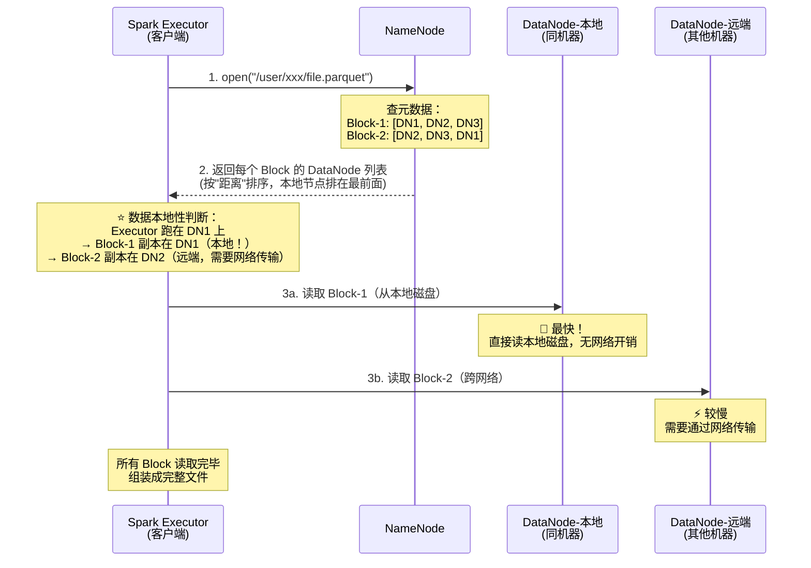

**数据本地性**（Data Locality）——这是 Spark + HDFS 性能的核心：

| 本地性级别 | 含义 | 速度 |
|-----------|------|------|
| **PROCESS_LOCAL** | 数据和计算在同一个 JVM 进程中 | 最快 |
| **NODE_LOCAL** | 数据在同一台机器的磁盘上（你集群的常见情况：Executor 和 DataNode 在同一节点） | 很快 |
| **RACK_LOCAL** | 数据在同一机架的不同机器上 | 较快 |
| **ANY** | 数据在别的机架，需要跨网络传输 | 慢 |

> **关键点**："Spark 调度任务时遵循'移动计算，不移动数据'的原则，优先把任务调度到数据所在的节点上执行。这就是为什么 Spark 要配合 HDFS 使用——HDFS 暴露了数据块的物理位置，Spark 的调度器根据这些位置信息实现数据本地性，大幅减少网络 IO。"

#### 图4：Spark on YARN + HDFS 联合运行全景图

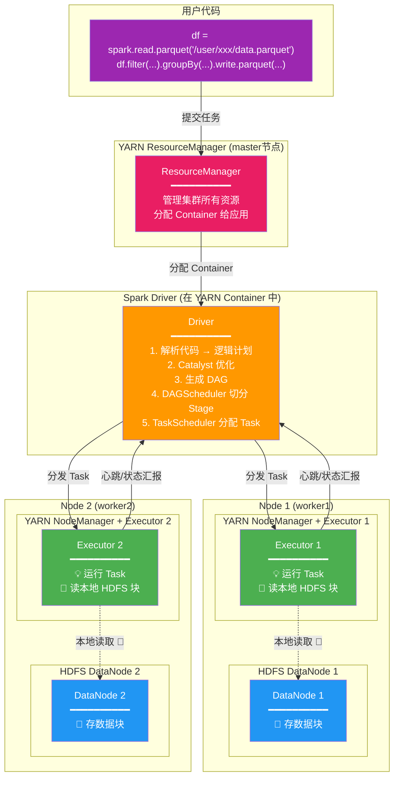

#### 图5：Spark 任务提交流程（从代码到执行）

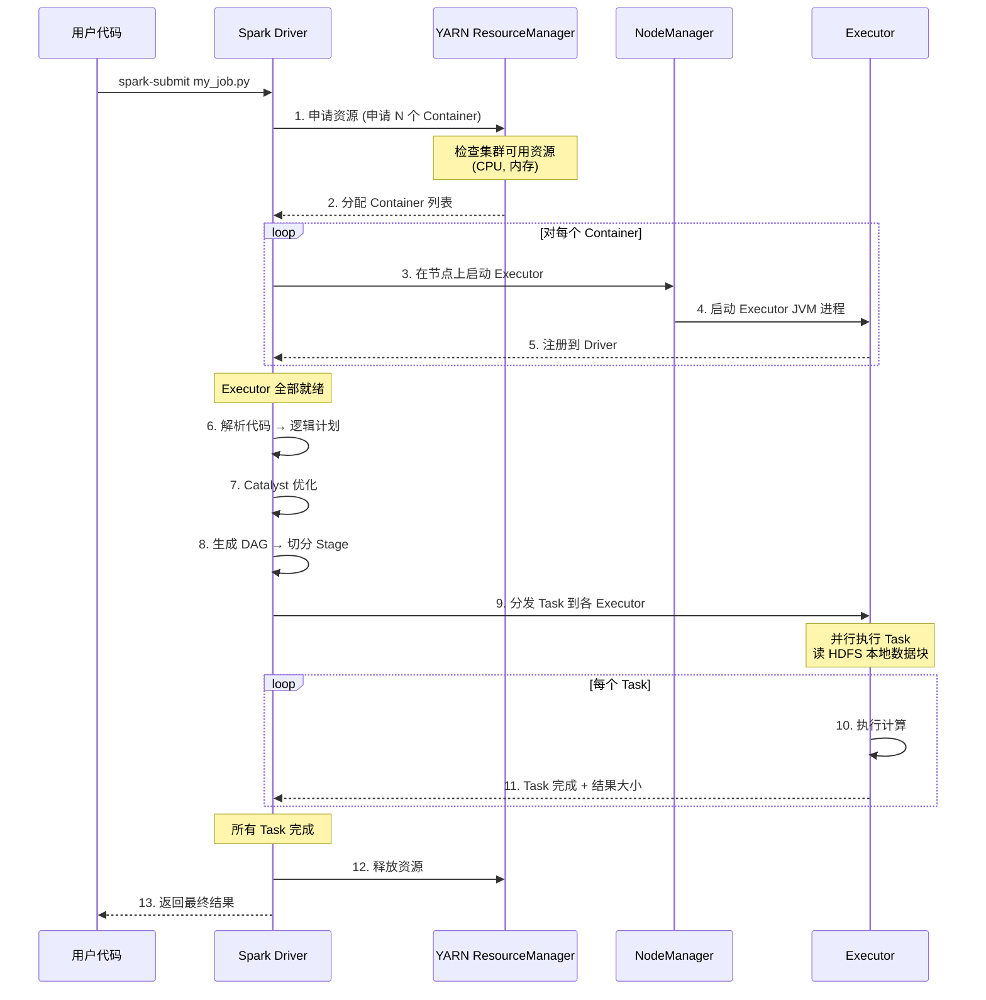

### 3.4 为什么 Spark 要从 HDFS 读数据，而不是本地文件？

假设你有 1000 张图片，存成本地文件在 master 上：

```
问题1：worker1 和 worker2 根本访问不到这些文件
问题2：所有数据都要从 master 通过网络传给 worker，master 的网络带宽成为瓶颈
问题3：如果 master 硬盘坏了，数据全丢
```

**放在 HDFS 上**：

```
- 数据块分散存储在 worker1 和 worker2 的硬盘上
- Spark 的 Executor 跑在 worker1 上时，优先读 worker1 本地的数据块（"数据本地性"）
- 跑在 worker2 上时，优先读 worker2 本地的数据块
- 网络传输量降到最低，速度最快
```

这就是为什么 **"数据在哪，计算就在哪"** 是 Hadoop/Spark 的核心设计思想。

### 3.5 你项目中的路径规范

| 用途 | HDFS 路径 | 含义 |
|------|-----------|------|
| 原始图片 | `/user/root/image-pipeline/input/` | 放从本地上传的图片数据 |
| 处理结果 | `/user/root/image-pipeline/output/` | 放清洗后的 Parquet 文件 |
| 临时数据 | `/user/root/image-pipeline/tmp/` | 放中间计算结果，用完可删 |

**在 PySpark 代码里怎么用这些路径？**

```python
# 读取 HDFS 上的 CSV 文件
df = spark.read.csv("/user/root/image-pipeline/input/users.csv")

# 写入 HDFS 的 output 目录
df.write.parquet("/user/root/image-pipeline/output/users_parquet")
```

这些代码在 Jupyter 里运行时，Spark 会自动去 HDFS 找文件，每个 Executor 从自己本地 DataNode 读数据块，实现分布式并行读取。

### 扩展：HDFS 常用命令速查表

| 操作 | HDFS 命令 | 类比 Linux |
|------|-----------|-----------|
| 列出目录 | `hdfs dfs -ls /path` | `ls /path` |
| 创建目录 | `hdfs dfs -mkdir /path` | `mkdir /path` |
| 上传文件 | `hdfs dfs -put local.txt /hdfs/path/` | `cp local.txt /hdfs/path/` |
| 下载文件 | `hdfs dfs -get /hdfs/path/file.txt ./` | `cp /hdfs/path/file.txt ./` |
| 查看文件内容 | `hdfs dfs -cat /hdfs/path/file.txt` | `cat file.txt` |
| 删除文件 | `hdfs dfs -rm /hdfs/path/file.txt` | `rm file.txt` |
| 递归删除目录 | `hdfs dfs -rm -r /hdfs/path/` | `rm -rf /hdfs/path/` |
| 查看文件大小 | `hdfs dfs -du -h /hdfs/path/` | `du -h /path` |
| 移动/重命名 | `hdfs dfs -mv /old /new` | `mv /old /new` |
| 查看磁盘使用 | `hdfs dfsadmin -report` | `df -h` |
| 检查文件块健康状态 | `hdfs fsck /path -files -blocks` | 无对应命令 |

---

## 四、常见 DataFrame 操作

| 操作 | 含义 | 生活类比 |
|------|------|----------|
| `df.show(n)` | 显示前 n 行 | 预览表格的前几行，看数据长什么样 |
| `df.printSchema()` | 打印列名和类型 | 看表格的表头结构 |
| `df.filter(条件)` | 筛选符合条件的行 | Excel 的"筛选"功能 |
| `df.groupBy(列名)` | 按某列分组 | Excel 的"分类汇总" |
| `df.orderBy(列名.desc())` | 按某列排序 | Excel 的"降序排列" |
| `df.write.parquet(路径)` | 保存为 Parquet 格式 | 把表格存成文件，下次直接读 |

### 扩展：DataFrame 操作分类（Transformation vs Action）

这是 Spark 最重要的核心概念之一——**惰性求值**（Lazy Evaluation）。

| 分类 | 含义 | 常见操作 | 触发执行？ |
|------|------|----------|-----------|
| **Transformation**（转换） | 描述"要做什么"，返回新的 DataFrame | `filter()`, `select()`, `groupBy()`, `orderBy()`, `withColumn()`, `join()`, `distinct()` | ❌ 不触发，只记录操作链（DAG） |
| **Action**（行动） | 真正触发计算，返回结果到 Driver | `show()`, `count()`, `collect()`, `write`, `first()`, `take(n)` | ✅ 触发！ |

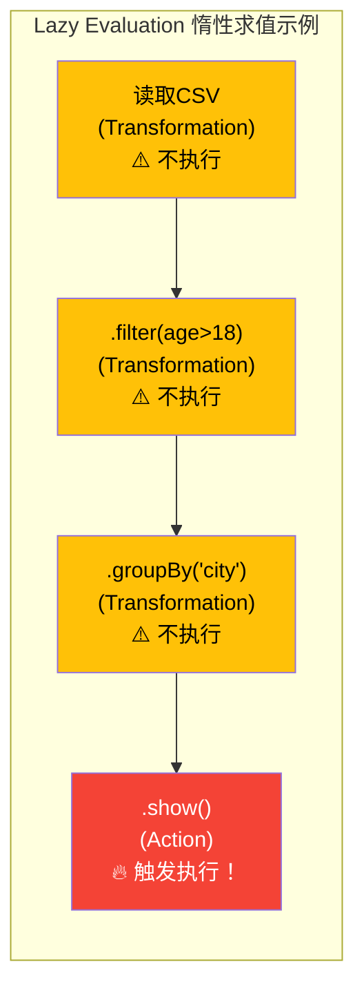

**为什么 Spark 要这样设计？**
- 当你写一串 Transformation 时，Spark 只是把操作记录到 DAG（有向无环图）里，并不真的执行
- 直到遇到 Action，Spark 才一次性优化整个 DAG，生成最优的执行计划
- 比如：`df.filter(age>18).select("name")` → Catalyst 可以推算出只需读取 age 和 name 列，跳过其他列（列剪枝 + 谓词下推）
- 如果把每个 Transformation 都立即执行，中间结果会很多、很慢

> **关键点**："Spark 的 Transformation 是惰性求值的，只构建 DAG；只有遇到 Action 才触发计算。这让 Catalyst 优化器能站在全局视角优化整个数据流，而不是孤立地优化每个步骤。"

---

## 五、Parquet 是什么？为什么用它？

**通俗理解**：
Parquet 是一种"列式存储"格式。想象一张表格：

| 存储方式 | 怎么存 | 优缺点 |
|----------|--------|--------|
| CSV（行式） | 一行一行地存：`1,Alice,25,Beijing; 2,Bob,30,Shanghai...` | 读全部列时快，但只读一列（比如只要年龄）也要扫全部数据 |
| **Parquet（列式）** | 一列一列地存：`1,2,3...`（id列）、`Alice,Bob,Charlie...`（name列）、`25,30,35...`（age列） | 只读某几列时极快，而且压缩率高，节省存储空间 |

**为什么你的项目要用 Parquet？**
- 图像处理完后，每张图片会有很多特征（感知哈希值、清晰度评分、标签等）
- 用 Parquet 存储，后续分析只需读取某几个列，速度快
- 压缩率高，节省 HDFS 空间
- Parquet 列式存储是数据工程的基础选型

### 扩展：行式存储 vs 列式存储（图示）

```
原始数据:
| id | name   | age | city     |
|----|--------|-----|----------|
| 1  | Alice  | 25  | Beijing  |
| 2  | Bob    | 30  | Shanghai |
| 3  | Charlie| 35  | Hangzhou |

━━━━━━━━━━━━━━━━━━━━━━━━━━━━━━━━━━━━━━━━

行式存储 (CSV):
[1,Alice,25,Beijing]
[2,Bob,30,Shanghai]
[3,Charlie,35,Hangzhou]

查询 "SELECT age FROM table" → 必须读所有行 ❌

━━━━━━━━━━━━━━━━━━━━━━━━━━━━━━━━━━━━━━━━

列式存储 (Parquet):
[1,2,3]              ← id 列
[Alice,Bob,Charlie]  ← name 列
[25,30,35]           ← age 列
[Beijing,Shanghai,Hangzhou] ← city 列

查询 "SELECT age FROM table" → 只读 age 列 🚀
查询 "SELECT name,age FROM table" → 只读 name 和 age 列 🚀
```

### 扩展：Parquet 高级特性

| 特性 | 说明 |
|------|------|
| **列式压缩** | 同一列的数据类型相同、数值相近，压缩效果远超行式（Snappy / Gzip / Zstd） |
| **Predicate Pushdown** | Parquet 文件内部有行组级别的统计信息（min/max），查询 `WHERE age > 20` 可以直接跳过最大值都 ≤20 的行组 |
| **Schema 演化** | 支持后续添加/删除列，不影响已有数据 |
| **嵌套数据** | 天然支持 JSON 风格的嵌套结构（struct, array, map） |

### 扩展：Spark 常用存储格式对比

| 格式 | 存储方式 | 压缩率 | 查询速度 | Schema支持 | 适用场景 |
|------|----------|--------|----------|-----------|----------|
| **CSV** | 行式文本 | 低 | 慢 | 无（首行可能是列名） | 数据交换、小数据集 |
| **JSON** | 行式文本 | 低 | 慢 | 嵌套结构支持 | API 数据、日志 |
| **Parquet** | 列式二进制 | 高（Snappy压缩） | 快（支持列剪枝） | Schema 内嵌 | **数据分析、特征工程（你的项目）** |
| **ORC** | 列式二进制 | 高（比Parquet更高一点） | 快 | Schema 内嵌 | Hive 生态、重度聚合 |
| **Avro** | 行式二进制 | 中 | 中等 | Schema 外置 | 流式写入、Kafka |

---

## 六、分布式执行是怎么体现的？

**你今天验证的三个层次**：

| 层次 | 在哪看 | 证明了什么 |
|------|--------|-----------|
| **YARN 集群** | `yarn node -list` | 有 2 个 NodeManager（worker1、worker2）在线 |
| **YARN 应用** | YARN Web UI → 应用列表 | 你的应用分���了 3 个 Container（1 个 driver + 2 个 executor） |
| **Executor 主机** | Jupyter 代码输出 | `Host: worker1`、`Host: worker2`——Executor 确实跑在两个不同节点上 |

**总结**：
> "我搭建了 3 节点的 Hadoop + Spark 集群，提交 PySpark 任务后，在 YARN Web UI 和 Executor 信息中确认任务被分发到两个 worker 节点并行执行，而不是单机模拟。"

### 扩展：Spark 作业内部执行原理 —— DAG 与 Stage 切分

这是 Spark 中最硬核、值得关注的知识点。

#### DAG（有向无环图）是什么？

你在代码中写的一系列 DataFrame 操作，Spark 内部会转化成一个 **DAG**——每个节点是一个 RDD/DataFrame，每条边是一个操作。因为有向无环，所以 Spark 知道哪些操作可以并行、哪些必须等待上游完成。

#### Stage 是怎么切分的？

**核心规则：遇到 Shuffle 操作就切一刀！**

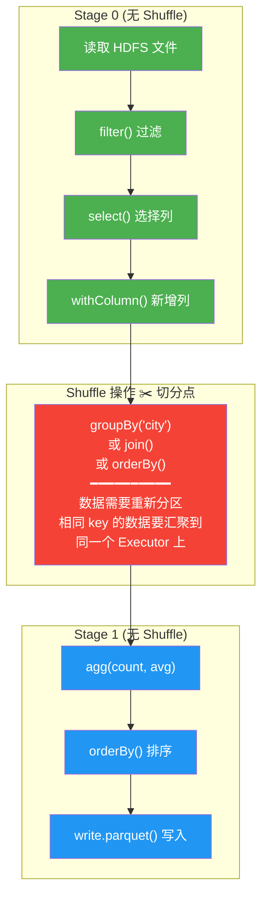

**Shuffle 的本质**：在上一个 Stage 的所有 Task 都完成后，把数据按 key 重新分发到不同的分区。这是 Spark 中最昂贵的操作，因为涉及：
1. **磁盘 IO**：上游 Task 把结果写到磁盘（shuffle write）
2. **网络传输**：下游 Task 从其他节点拉取数据（shuffle read）
3. **等待依赖**：下游 Stage 必须等上游 Stage 全部完成才能开始

#### Stage 内部：Task 是执行的基本单位

```
Stage 0（3 个分区 × filter + select）
├── Task 1 → Executor 1 (worker1), 处理 partition 1
├── Task 2 → Executor 2 (worker2), 处理 partition 2
└── Task 3 → Executor 1 (worker1), 处理 partition 3

         ↓ Shuffle ↓

Stage 1（2 个分区 × groupBy + agg）
├── Task 1 → Executor 1 (worker1), 处理 shuffle 后的 partition 1
└── Task 2 → Executor 2 (worker2), 处理 shuffle 后的 partition 2
```

> **关键点**："Spark 作业被 DAGScheduler 根据 Shuffle 依赖切成多个 Stage，每个 Stage 包含多个可以并行执行的 Task，Task 是 Spark 执行的最小单位。Shuffle 是 Spark 中开销最大的操作，因为它涉及磁盘 IO 和网络传输。"

### 扩展：Shuffle 触发操作一览

| Shuffle 类型 | 常见操作 | 说明 |
|-------------|----------|------|
| **重分区** | `repartition()`, `coalesce()` | 改变分区数 |
| **聚合** | `groupBy()`, `groupByKey()`, `reduceByKey()` | 将相同 key 的数据聚集到一起 |
| **Join** | `join()`, `leftOuterJoin()` | 两个 DataFrame/RDD 按 key 合并 |
| **排序** | `orderBy()`, `sortBy()` | 全局排序需要重新分区 |
| **去重** | `distinct()`, `dropDuplicates()` | 去重需要按所有列 shuffle |

---

## 七、本地文件 vs HDFS 文件的使用场景

| 场景 | 放在哪 | 原因 |
|------|--------|------|
| 临时测试数据（如今天的 10 行 CSV） | 先在本地生成，再上传 HDFS | 方便快速验证代码 |
| 正式数据集（如 Kaggle 图片） | 下载到本地 `data/raw/`，然后上传 HDFS 的 `input/` | Spark 直接读 HDFS，支持分布式并行读取 |
| 处理结果 | 写入 HDFS 的 `output/` | 数据量可能很大，HDFS 天然支持大文件存储和备份 |
| Jupyter Notebook | 保存在本地 `notebooks/` | 方便版本管理和编辑 |

### 扩展：HDFS 的适用与不适用场景

| ✅ 适合 HDFS | ❌ 不适合 HDFS |
|-------------|---------------|
| 大文件（100MB+）批处理 | 大量小文件（元数据撑爆 NameNode 内存） |
| 一次写入、多次读取 | 频繁修改、随机写入 |
| 高吞吐量优先 | 低延迟实时访问（用 HBase / Redis） |
| 数据需要跨节点共享 | 临时中间结果（用本地磁盘） |

---

## 八、SSH 隧道是什么？为什么用它？

**通俗理解**：
你的 Windows 电脑和阿里云服务器之间有公网相隔。想访问服务器上的 Jupyter（8888端口）、YARN UI（8088端口）、Spark UI（4040端口），如果不开放安全组端口，外界无法访问。开放端口又有安全风险（被扫描、攻击）。

**SSH 隧道就像修了一条"加密地下通道"**：
- 你在本地执行 `ssh -L 8888:localhost:8888 root@<your-server-ip>`
- 意思是："把我本地的 8888 端口，通过 SSH 加密通道，映射到服务器上的 8888 端口"
- 这样你在浏览器访问 `http://localhost:8888`，流量会通过加密隧道传到服务器上，安全、免开端口

### 扩展：SSH 端口映射三种模式

| 模式 | 命令参数 | 方向 | 使用场景 |
|------|----------|------|----------|
| **本地转发** | `ssh -L 本地端口:目标主机:目标端口` | 本地 → 远程 | 访问远程服务器上的 Web UI（**你的场景**） |
| **远程转发** | `ssh -R 远程端口:目标主机:目标端口` | 远程 → 本地 | 让远程服务器访问你本地的服务（如内网穿透） |
| **动态转发** | `ssh -D 本地端口` | SOCKS 代理 | 把 SSH 服务器当作跳板/代理上网 |

---

## 九、项目目录结构设计思想

**为什么要分门别类？**
- `data/raw/`：存放原始数据，不动它，保持数据源头干净
- `scripts/`：可复用的 Python 脚本，比如 UDF、清洗逻辑
- `notebooks/`：Jupyter Notebook，用于探索性分析
- `output/`：处理后的结果
- `logs/`：日志文件

这样设计的好处：别人打开你的项目，一眼就知道什么东西在哪；你自己过一个月回头看，也不会乱。

### 扩展：推荐的大数据项目目录结构

```
image-pipeline/
├── data/
│   ├── raw/           # 原始数据（只读，永远不改）
│   ├── processed/     # 清洗后的数据
│   └── external/      # 外部数据（如参考数据集）
├── notebooks/
│   ├── 01_data_exploration.ipynb   # 数据探索
│   ├── 02_data_cleaning.ipynb      # 数据清洗
│   └── 03_feature_engineering.ipynb # 特征工程
├── scripts/
│   ├── config.py       # 全局配置（路径、参数）
│   ├── preprocess.py   # 预处理逻辑
│   ├── features.py     # 特征提取
│   └── udf_library.py  # 自定义 UDF 集合
├── config/
│   ├── spark.conf      # Spark 配置
│   └── logging.conf    # 日志配置
├── output/
│   └── features/       # 特征输出（Parquet 文件）
├── logs/
│   └── spark.log
└── README.md
```

---

## 十、Spark 宽依赖 vs 窄依赖（核心考点）

这个概念是理解 Stage 切分和 Shuffle 的基础。

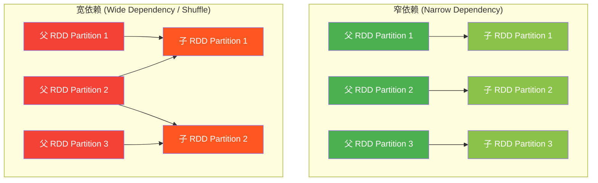

| 对比维度 | 窄依赖 (Narrow) | 宽依赖 (Wide / Shuffle) |
|----------|----------------|------------------------|
| **定义** | 父 RDD 的每个 Partition **最多**被一个子 RDD Partition 使用 | 父 RDD 的每个 Partition 被**多个**子 RDD Partition 使用 |
| **类比** | 独生子女 | 多个孩子共享父母 |
| **是否需要 Shuffle** | ❌ 不需要 | ✅ 需要 |
| **能否 Pipeline 执行** | ✅ 可以（同一个 Stage 内流水线执行） | ❌ 不能（必须切 Stage） |
| **容错** | 只需重算丢失的分区对应的上游分区 | 一个分区丢失可能导致整个上游重算 |
| **常见操作** | `map`, `filter`, `flatMap`, `select`（父子分区一对一） | `groupByKey`, `reduceByKey`, `join`（非分区对齐的 join） |

> **关键点**："宽依赖和窄依赖的区别在于：父 Partition 是否被多个子 Partition 依赖。窄依赖不需要 Shuffle，宽依赖需要。这也是 DAGScheduler 切分 Stage 的依据——宽依赖是 Stage 的边界。"

---

## 十一、今日知识点对照

| 今天学的内容 | 常见问题 | 回答要点 |
|-------------|---------------|----------|
| SparkSession 创建和配置 | "Spark on YARN 是怎么提交的？" | 集群架构、ResourceManager、Container 分配 |
| DataFrame 操作（filter/groupBy/orderBy） | "DataFrame 和 RDD 有什么区别？" | Schema、Catalyst 优化器、Tungsten 内存管理 |
| HDFS 读写文件 | "HDFS 的读写流程是怎样的？数据本地性是什么意思？" | NameNode 元数据、DataNode 数据块、流水线复制 |
| Parquet 存储格式 | "Parquet 和 CSV 有什么区别？为什么用 Parquet？" | 列式存储、压缩率、列剪枝、谓词下推 |
| 分布式执行验证（Executor Hosts） | "你怎么确认任务是分布式执行的？" | YARN Web UI、Executor 日志、多 Host 输出 |
| SSH 隧道 | "你怎么在本地查看 Spark UI？" | SSH 端口转发，安全免开端口 |
| 本地文件 vs HDFS | "为什么 Spark 要从 HDFS 读数据而不是本地文件？" | 数据本地性、分布式读取、容错 |
| **扩展考点** | | |
| DAG 和 Stage 切分 | "Spark 怎么把代码变成分布式任务执行的？" | DAGScheduler、Shuffle 切 Stage、Task 并行 |
| 宽依赖 vs 窄依赖 | "宽依赖和窄依赖的区别？" | 一对一 vs 多对多、是否 Shuffle、Stage 划分 |
| Catalyst 优化器 | "Spark SQL 是怎么优化查询的？" | 逻辑计划 → 优化 → 物理计划 → 代码生成 |
| Lazy Evaluation | "Spark 的惰性求值是什么意思？有什么好处？" | Transformation vs Action、DAG 构建、全局优化 |

---

*文档版本：扩充版 | 更新时间：2025年 | 基于 W3 周二前置知识文档扩充，新增 Spark/HDFS 架构图和核心考点*
