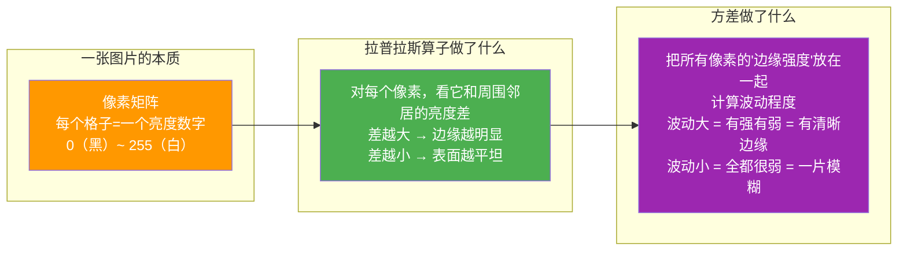
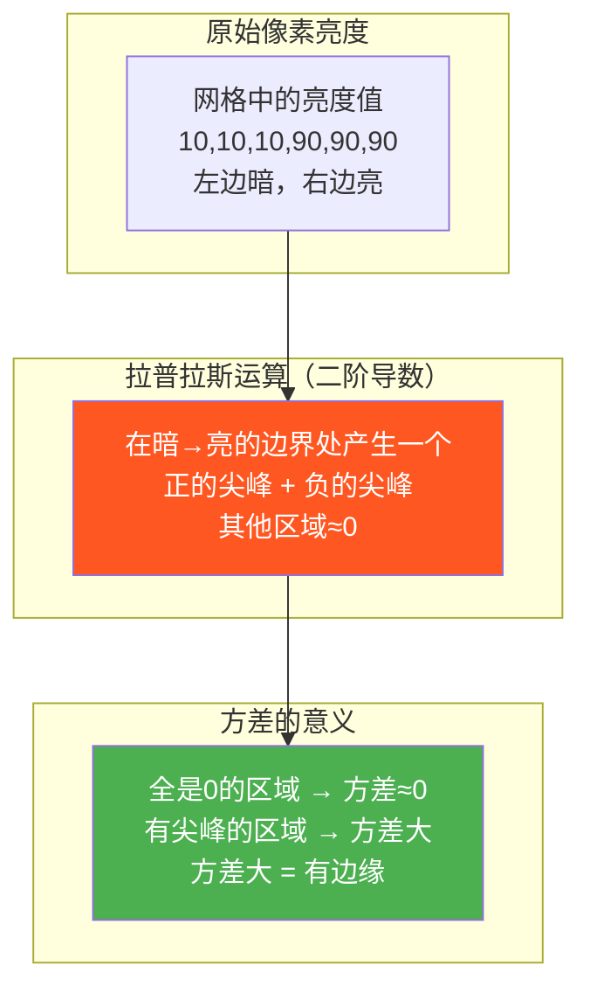
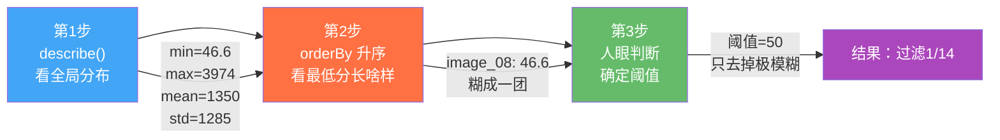
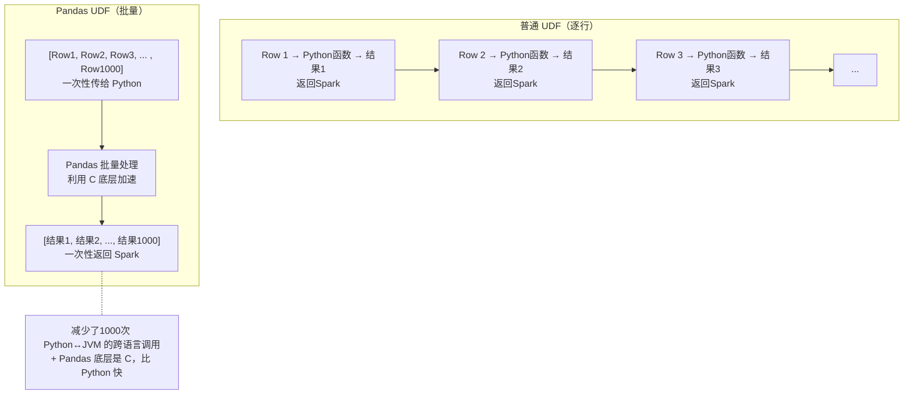
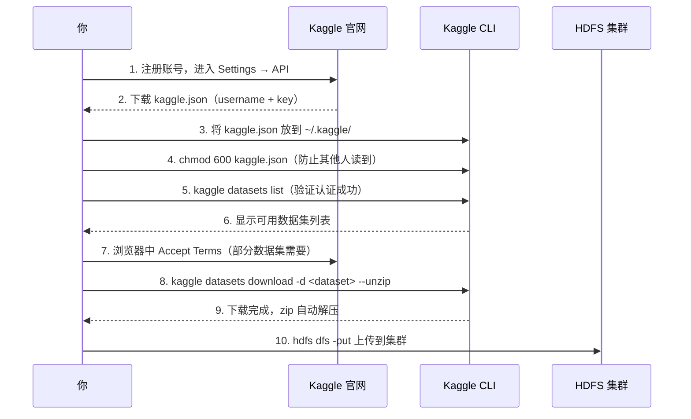
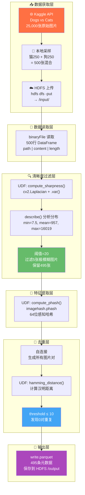
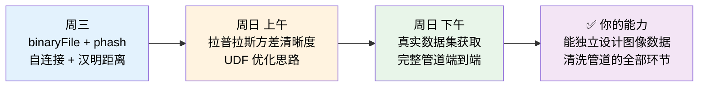

# W3 周日学习总结：完整图像清洗管道 + 真实数据集实战（扩充版）

---

## 先看全景：今天一整天做了什么？

```mermaid
graph TB
    subgraph "🌅 上午：本地测试 + 清晰度算法"
        A1["📁 14张测试图片"] --> A2["🔧 UDF: compute_sharpness()<br/>拉普拉斯方差计算"]
        A2 --> A3["📊 describe() 分析分布"]
        A3 --> A4["🎯 阈值=50 → 过滤1张模糊图"]
        A4 --> A5["🔗 串联：清晰度过滤 → 感知哈希 → 去重"]
    end

    subgraph "🌇 下午：真实数据集 + 完整管道"
        B1["🌐 Kaggle API 下载<br/>Dogs vs Cats 数据集"] --> B2["📁 整理500张猫狗混合图"]
        B2 --> B3["☁️ HDFS 上传"]
        B3 --> B4["📖 binaryFile 读取"]
        B4 --> B5["🔧 清晰度评分: min=7.5, max=16019"]
        B5 --> B6["🎯 阈值=20 → 过滤5张"]
        B6 --> B7["🔑 感知哈希指纹"]
        B7 --> B8["📏 汉明距离去重 → 0对重复"]
        B8 --> B9["💾 write.parquet 保存"]
    end

    style A1 fill:#42A5F5,color:#fff
    style A5 fill:#66BB6A,color:#fff
    style B1 fill:#FF7043,color:#fff
    style B9 fill:#AB47BC,color:#fff
```



**一句话总结今天**：上午用14张图把"清晰度过滤"讲透，下午用500张真实猫狗图把整条管道跑通——从Kaggle下载到Parquet输出，端到端。

---

## 🌅 一、上午核心：拉普拉斯方差 —— 怎么用数学判断图片"糊不糊"？

### 1.1 先问一个傻问题：什么叫"清晰"？

想象你在看两张照片：

- **清晰照片**：猫的胡须根根分明，毛的边缘锐利得像刀刻的 → **边缘多、变化剧烈**
- **模糊照片**：猫像个毛绒球，边缘和背景糊在一起 → **边缘少、变化平缓**

拉普拉斯方差就是把这种"人眼的直观感受"变成**一个数字**。

### 1.2 拉普拉斯算子到底算了什么？



### 1.3 代码逐行拆解：你在做什么？

```python
import cv2
import numpy as np
from PIL import Image
import io

def compute_sharpness(binary_data):
    """
    输入：图片的原始字节（和 phash UDF 一样）
    输出：一个浮点数，越大越清晰
    """
    # 第1步：bytes → PIL Image → numpy 数组
    #        就像把压缩包解压成一张能处理的"纸"
    img = Image.open(io.BytesIO(binary_data))
    img_np = np.array(img)

    # 第2步：转灰度图
    #        彩色图有 RGB 三个通道，我们只关心明暗，不关心颜色
    #        就像把彩色电视关成黑白电视
    gray = cv2.cvtColor(img_np, cv2.COLOR_RGB2GRAY)

    # 第3步：拉普拉斯算子
    #        对每个像素，计算它和邻居的"亮度跳跃"
    #        cv2.CV_64F 表示结果用 64 位浮点数（因为拉普拉斯有正有负）
    laplacian = cv2.Laplacian(gray, cv2.CV_64F)

    # 第4步：方差
    #        把这些"跳跃值"的波动程度算出来
    #        跳跃有大有小 → 方差大 → 清晰
    #        跳跃全都很小 → 方差小 → 模糊
    return float(laplacian.var())
```

**`cv2.CV_64F` 为什么重要？**

| 数据类型 | 取值范围 | 问题 |
|----------|----------|------|
| `cv2.CV_8U`（8位无符号整数） | 0~255 | 拉普拉斯会产生**负数**（亮→暗的过渡），负数在无符号整型里会变成奇怪的数 |
| `cv2.CV_64F`（64位浮点数） | 正负都有 | 负数正常保存，方差计算才正确 |

> **一句话记忆**：计算拉普拉斯用 `CV_64F`，因为它能存负数；计算方差就是看边缘强度的"波动"程度。

### 1.4 图解：清晰图 vs 模糊图的拉普拉斯差异

```
清晰图片（猫胡须分明）：
    像素值变化: ██▓▓░░▒▒██ ██░░▓▓▒▒██
                  ↑    ↑    ↑  ← 边缘多，跳跃剧烈
    拉普拉斯结果: [120, -98, 56, -45, 89, -102, ...]
    方差: 3974（高分！）

模糊图片（糊成一团）：
    像素值变化: ████████▓▓▓▓▓▓████████████
                平滑过渡 ← 没有明显跳跃
    拉普拉斯结果: [3, -2, 1, -5, 2, -4, ...]
    方差: 7.5（低分！）
```

### 1.5 一个关键细节：为什么先转灰度？

```python
gray = cv2.cvtColor(img_np, cv2.COLOR_RGB2GRAY)
```

有两点原因：
1. **计算量**：灰度图只有 1 个通道，彩色图有 3 个通道（R、G、B）。灰度图计算量是彩色的 1/3
2. **语义正确**："边缘"本质是**亮度**的跳变，颜色信息对边缘检测帮助不大

### 1.6 图形解释：拉普拉斯算子在干什么



---

## 🌅 二、上午核心：阈值选择方法论 —— 不是一个固定数字

### 2.1 你做了三步，每一步都有道理



### 2.2 为什么不能硬套别人的阈值？

| 场景 | 数据特点 | 合理阈值 |
|------|----------|----------|
| 你的14张测试图 | min=46.6, 质量总体还行 | 50 |
| 你的500张猫狗图 | min=7.5, 存在极度模糊 | 20 |
| 别人的人脸数据集 | 可能 min=200, 都是高清的 | 500 |
| 别人的监控视频帧 | 可能 min=0.5, 普遍很糊 | 10 |

**核心原则**：阈值 = **数据的特性** × **你的业务目标**，不是查表查出来的。

### 2.3 阈值要不要设成动态的？

```python
# 方案A：固定阈值（你用的方式）
threshold = 20
clean = df.filter(col("sharpness") > threshold)

# 方案B：百分位阈值（自动适应数据）
# 比如，去掉最模糊的 1%
import pyspark.sql.functions as F
quantile_1 = df.approxQuantile("sharpness", [0.01], 0.01)[0]
clean = df.filter(col("sharpness") > quantile_1)

# 方案C：基于标准差的阈值
mean_val = df.select(F.mean("sharpness")).first()[0]
std_val = df.select(F.stddev("sharpness")).first()[0]
threshold = mean_val - 2 * std_val  # 去掉低于均值2个标准差的
```

| 方案 | 优点 | 缺点 |
|------|------|------|
| 固定阈值 | 简单、可解释、可复现 | 换一批数据可能不适用 |
| 百分位阈值 | 自动适应不同数据集 | 可能去掉正常图片（如果数据整体质量高） |
| 标准差阈值 | 统计上有理论依据 | 假设数据正态分布（图片清晰度常常不符合） |

> **面试金句**："阈值选择不能硬套固定值。我的方法是三步走：先 describe 看分布全貌，再 orderBy 看最低分样本实际长什么样，最后结合业务目标决定——是只要'去掉垃圾'还是'保留精品'。对于清晰度过滤，我倾向于保守（只去掉极模糊的），因为去重环节还能兜底。"

---

## 🌅 三、上午核心：UDF 优化 —— 你的清晰度 UDF 可以更快吗？

### 3.1 逐行 UDF vs 批量 Pandas UDF

你现在写的是普通的逐行 UDF：

```python
# 逐行 UDF：每个 Executor 一次处理一行
sharpness_udf = udf(compute_sharpness, FloatType())
df.withColumn("sharpness", sharpness_udf("content"))
```

可以升级为批量 Pandas UDF：

```python
from pyspark.sql.functions import pandas_udf
import pandas as pd

@pandas_udf(FloatType())
def compute_sharpness_batch(content_series: pd.Series) -> pd.Series:
    """
    content_series: 一批图片的字节数据（比如1000行）
    返回: 一批清晰度分数
    """
    import cv2, numpy as np
    from PIL import Image
    import io

    def single_sharpness(bs):
        img = Image.open(io.BytesIO(bs))
        gray = cv2.cvtColor(np.array(img), cv2.COLOR_RGB2GRAY)
        return float(cv2.Laplacian(gray, cv2.CV_64F).var())

    return content_series.apply(single_sharpness)

# 使用方式和普通 UDF 一模一样
df.withColumn("sharpness", compute_sharpness_batch("content"))
```

### 3.2 为什么 Pandas UDF 更快？



> **什么时候值得升级**：处理 500 张图，逐行 UDF 完全够用。当你处理 50,000 张以上时，Pandas UDF 的优势才明显。

### 3.3 另一个优化思路：合并 UDF

你有两个 UDF：`compute_sharpness` 和 `compute_phash`。它们的第一步都是 `Image.open(io.BytesIO(binary_data))`——这意味着每张图片**被解码了两次**。

```python
# 优化：一次解码，同时计算清晰度和感知哈希
def compute_features(binary_data):
    from PIL import Image
    import io, cv2, numpy as np, imagehash

    img = Image.open(io.BytesIO(binary_data))   # ← 只解码一次！

    # 清晰度
    gray = cv2.cvtColor(np.array(img), cv2.COLOR_RGB2GRAY)
    sharpness = float(cv2.Laplacian(gray, cv2.CV_64F).var())

    # 感知哈希
    phash = str(imagehash.phash(img))

    return (sharpness, phash)
```

> **面试金句**："当多个 UDF 共享 IO 操作时，合并成一个 UDF 返回 struct 可以减少重复解码。在大数据量下，图片解码往往是瓶颈，合并 UDF 可以节省 50% 的 IO 时间。"

---

## 🌇 四、下午核心：Kaggle API —— 真实数据从哪来

### 4.1 完整的认证流程



### 4.2 kaggle.json 的两个字段

```json
{
    "username": "你的Kaggle用户名",
    "key": "一串很长的API密钥"
}
```

这两个字段分别是什么意思？

| 字段 | 作用 | 类比 |
|------|------|------|
| `username` | 标识"你是谁" | 你的身份证号 |
| `key` | 证明"你确实是你" | 你的密码/签名 |

> **安全提醒**：`key` 等于你的 Kaggle 密码，**绝对不能**提交到 Git 仓库里。

### 4.3 为什么会有 403 错误？两个最常见的原因

| 原因 | 现象 | 解决 |
|------|------|------|
| 没配 kaggle.json | `kaggle datasets download` 报 403 | 创建 `~/.kaggle/kaggle.json` |
| 没接受使用条款 | 同一个人发了数据集，但还是 403 | 在浏览器打开数据集页面，点击 "Accept Terms" |

**第二个原因很多人踩坑**：Kaggle 要求你在浏览器里点击"我接受"，这个操作和 API key 无关。你用 key 只能证明"是你"，但 Kaggle 还要确认"你答应了使用条款"。

---

## 🌇 五、下午核心：完整管道架构详解

### 5.1 管道全景图



### 5.2 为什么这个顺序不能乱？

管道的顺序是**有意设计的**：

| 步骤 | 为什么放在这 | 如果调换顺序会怎样 |
|------|-------------|-------------------|
| 清晰度过滤 → 去重 | 先去模糊再查重，减少自连接的计算量 | 先去重再过滤：模糊图参与自连接，白白浪费计算 |
| 自连接只处理 495 张 | N=495，自连接产生 495²=245,025 对 | 如果 500 张全参与：500²=250,000 对，多了 5,000 对 |

**设计原则**：**计算量大的操作放在后面，先用廉价操作削减数据量**。

> **面试金句**："管道的顺序遵循'先轻量后重量'原则。清晰度过滤用 UDF 逐行计算，复杂度 O(n)；自连接去重需要生成所有图片对再计算汉明距离，复杂度 O(n²)。所以先过滤掉模糊图，让数据量从 500 降到 495，虽然差距不大，但在处理百万级数据时，这种设计能节省大量集群资源。"

### 5.3 各步骤的计算复杂度对比

| 操作 | 复杂度 | 500张耗时 | 100万张预估 |
|------|--------|-----------|-------------|
| binaryFile 读取 | O(n) | 几秒 | 几分钟 |
| 清晰度 UDF | O(n × 图片大小) | 几秒 | 几十分钟 |
| 感知哈希 UDF | O(n × 图片大小) | 几秒 | 几十分钟 |
| 自连接 | O(n²) | 245K 对 | **10¹² 对（灾难）** |

这就是为什么真实生产环境中，自连接去重要做优化——比如先用分桶减少配对、或者用 LSH（局部敏感哈希）代替 O(n²) 的暴力比较。

### 5.4 代码全景：管道的完整实现

```python
from pyspark.sql import SparkSession
from pyspark.sql.functions import udf, col
from pyspark.sql.types import FloatType, StringType, IntegerType
import cv2, numpy as np
from PIL import Image
import imagehash, io

spark = SparkSession.builder \
    .appName("ImageCleaningPipeline") \
    .getOrCreate()

# ============================================
# 第1步：读取图片
# ============================================
df = spark.read.format("binaryFile") \
    .load("/user/root/image-pipeline/input/*.jpg")

print(f"读取了 {df.count()} 张图片")

# ============================================
# 第2步：计算清晰度
# ============================================
def compute_sharpness(binary_data):
    img = Image.open(io.BytesIO(binary_data))
    gray = cv2.cvtColor(np.array(img), cv2.COLOR_RGB2GRAY)
    return float(cv2.Laplacian(gray, cv2.CV_64F).var())

sharpness_udf = udf(compute_sharpness, FloatType())
df = df.withColumn("sharpness", sharpness_udf("content"))

# 分析分布
df.select("sharpness").describe().show()
df.select("path", "sharpness").orderBy("sharpness").show(10)

# ============================================
# 第3步：过滤模糊图片
# ============================================
SHARPNESS_THRESHOLD = 20
df_clean = df.filter(col("sharpness") > SHARPNESS_THRESHOLD)
print(f"过滤后剩余 {df_clean.count()} 张（过滤掉 {df.count() - df_clean.count()} 张）")

# ============================================
# 第4步：计算感知哈希
# ============================================
def compute_phash(binary_data):
    img = Image.open(io.BytesIO(binary_data))
    return str(imagehash.phash(img))

phash_udf = udf(compute_phash, StringType())
df_clean = df_clean.withColumn("phash", phash_udf("content"))

# ============================================
# 第5步：自连接 + 汉明距离去重
# ============================================
def hamming_distance(h1, h2):
    """计算两个十六进制哈希字符串的汉明距离"""
    hash1 = int(h1, 16)
    hash2 = int(h2, 16)
    return bin(hash1 ^ hash2).count('1')

hamming_udf = udf(hamming_distance, IntegerType())

# 自连接（只保留 path1 < path2，避免重复配对和自己配自己）
from pyspark.sql.functions import col as col_
joined = df_clean.alias("a").join(
    df_clean.alias("b"),
    col_("a.path") < col_("b.path"),
    "inner"
)

# 计算汉明距离
joined = joined.withColumn(
    "distance",
    hamming_udf(col_("a.phash"), col_("b.phash"))
)

# 筛选重复
DUPLICATE_THRESHOLD = 10
duplicates = joined.filter(col("distance") <= DUPLICATE_THRESHOLD)
print(f"发现 {duplicates.count()} 对重复图片")

# ============================================
# 第6步：保存结果
# ============================================
df_clean.select("path", "sharpness", "phash") \
    .write.mode("overwrite") \
    .parquet("/user/root/image-pipeline/output/clean_images.parquet")

print("管道完成！结果已保存到 HDFS")
```

---

## 🌇 六、下午核心：Parquet 输出 —— 为什么不是 CSV？

### 6.1 Parquet vs CSV：一个表格看清楚

| 对比维度 | CSV | Parquet |
|----------|-----|---------|
| **存储方式** | 按行存储（一行一行写） | 按列存储（一列一列写） |
| **文件大小** | 大（纯文本，无压缩优势） | 小（列式压缩，通常小 50%~80%） |
| **读取速度** | 全表扫描，读全部列 | 只读需要的列，跳过不需要的列 |
| **数据类型** | 全是字符串，需要手动转换 | 保留原始类型（int、float、string） |
| **嵌套结构** | 不支持 | 原生支持（array、struct、map） |
| **Schema** | 没有（列名在文件第一行） | 自带（存在文件尾部） |
| **压缩** | 需外部工具 | 内置压缩（Snappy、Gzip、Zstd） |

### 6.2 图解：行式存储 vs 列式存储

```
CSV（行式存储）：
[path1, sharpness1, phash1, path2, sharpness2, phash2, path3, sharpness3, phash3, ...]
 第一行全部字段 → 第二行全部字段 → 第三行全部字段 →

如果你只想读 sharpness 列 → 必须扫过 path 和 phash → 浪费IO


Parquet（列式存储）：
[path1, path2, path3, ...]          ← path 列单独存一块
[sharpness1, sharpness2, sharpness3, ...]  ← sharpness 列单独存一块
[phash1, phash2, phash3, ...]       ← phash 列单独存一块

如果你只想读 sharpness 列 → 直接跳到 sharpness 那块 → 只读你需要的数据
```

### 6.3 什么时候用哪种格式？

| 场景 | 推荐格式 | 原因 |
|------|----------|------|
| 数据分析、OLAP 查询 | Parquet | 列式存储，聚合查询快 |
| 数据交换、给非技术人员 | CSV | 任何软件都能打开 |
| 流式写入、日志 | JSON | 人类可读、逐行追加方便 |
| 机器学习训练 | Parquet / TFRecord | 压缩率高、读取快 |
| 你现在的场景（保存清洗元数据） | Parquet | 后续分析只要读 sharpness/phash 列 |

> **面试金句**："选择 Parquet 有三个理由：一是列式存储，下游分析只读需要的列，IO 效率高；二是自带 Schema，类型信息不丢失；三是压缩率高，在 HDFS 上占用的存储空间小。CSV 适合数据交换，Parquet 适合数据分析和存储。"

---

## 🔄 七、全天串起来：上午 vs 下午的对比

### 7.1 两次阈值选择对比

| 维度 | 上午（测试） | 下午（真实） |
|------|-------------|-------------|
| 数据量 | 14张 | 500张（采样自25,000） |
| 数据来源 | 手工准备 | Kaggle Dogs vs Cats |
| 清晰度范围 | 46.6 ~ 3974 | 7.5 ~ 16019 |
| 均值 | 1350 | 957 |
| 阈值 | 50 | 20 |
| 过滤数量 | 1张（7%） | 5张（1%） |
| 过滤原因 | 极模糊 | 极模糊（7.5~18.4） |

**关键洞察**：500 张中只有 1%（5 张）被过滤，说明 Dogs vs Cats 数据集整体质量很高——这些图片大多是从网上爬的，本身就有一定质量标准。

### 7.2 你的学习曲线



---

## 🧩 八、拓展：这些知识面试官还能怎么问？

### 8.1 关于拉普拉斯清晰度

| 面试问题 | 你的回答要点 |
|----------|-------------|
| "拉普拉斯方差为什么能衡量清晰度？" | 拉普拉斯算子检测边缘（二阶导数），清晰图片边缘多 → 算子响应大 → 方差大 |
| "除了拉普拉斯方差，还有什么清晰度指标？" | Sobel 算子（一阶导数）、Brenner 梯度、Tenengrad、FFT 频域分析 |
| "为什么用方差而不是直接用拉普拉斯的总和？" | 方差归一化了图片大小的影响。总和会因图片尺寸不同而变化，方差不会 |
| "计算清晰度前为什么要转灰度？" | 边缘是亮度跳变，颜色通道对边缘检测贡献不大；灰度图计算量只有 1/3 |

### 8.2 关于阈值选择

| 面试问题 | 你的回答要点 |
|----------|-------------|
| "阈值怎么定？" | 三步法：describe 看分布 → orderBy 看样本 → 根据业务目标拍板 |
| "如果数据量太大，没法人眼看怎么办？" | 用百分位数（如去掉最低 1%）、或用标准差方法、或找标注数据训练分类器 |
| "你的阈值 20 可靠吗？" | 在 Dogs vs Cats 数据集上经过了人工验证（看最低 10 张图确认），但换数据集需要重新评估 |

### 8.3 关于管道设计

| 面试问题 | 你的回答要点 |
|----------|-------------|
| "为什么先去模糊再去重？" | 自连接去重 O(n²)，模糊过滤 O(n)。先减少 n，让去重计算量变小 |
| "如果数据量是 100 万张，你的管道怎么调整？" | ① Pandas UDF 加速计算；② 分桶代替全量自连接（O(n²) → O(kn)）；③ 增加 Spark 分区数；④ 用 LSH 加速去重 |
| "Spark 管道怎么处理错误数据？" | try-except 在 UDF 中捕获异常，返回 None；后续 filter 去掉异常行 |

### 8.4 关于 Parquet

| 面试问题 | 你的回答要点 |
|----------|-------------|
| "Parquet 和 ORC 有什么区别？" | 都是列式存储。Parquet 生态更广（Spark、Pandas、DuckDB），ORC 在 Hive 环境下性能略优 |
| "Parquet 的压缩是怎么工作的？" | 列式压缩：同一列的数据类型相同、数值相近，压缩率比行式高得多（如 Run-Length Encoding + Dictionary Encoding + Snappy） |
| "Parquet 文件怎么快速预览？" | `parquet-tools` 命令行工具、PySpark 的 `spark.read.parquet().show()`、Pandas 的 `pd.read_parquet()` |

---

## 📋 九、今天遇到的错误与解决（沉淀版）

| 错误 | 症状 | 根因 | 解决 | 避免方法 |
|------|------|------|------|----------|
| Kaggle 403 | `kaggle datasets download` 报 403 Forbidden | 数据集需要在网页端 Accept Terms | 浏览器打开数据集页面点击 "I Accept" | 下载前先检查数据集页面是否有使用条款 |
| 文件名冲突 | 猫狗目录下转移后只剩 250 张 | 同名文件互相覆盖 | 用 `cat_` 和 `dog_` 前缀重命名 | 合并不同来源的文件时，始终加前缀 |
| YARN 资源不足 | Spark 提交失败 | 上一个 SparkSession 残留未释放 | `yarn application -kill <app_id>` | 每次 `spark.stop()` 后用 `yarn application -list` 确认 |
| 单张极模糊图片方差 7.5 | 500 张中出现 variance=7.5 | 图片可能下载损坏或本身就是纯色图 | 阈值 20 过滤掉 | 管道前端加入文件完整性校验 |

---

## 🎯 十、自我检查清单

学完今天的内容，你应该能回答以下问题：

- [ ] 拉普拉斯方差为什么能衡量图片清晰度？（原理层面）
- [ ] `cv2.Laplacian(gray, cv2.CV_64F).var()` 每一步在做什么？（代码层面）
- [ ] 阈值怎么确定？`describe()` + `orderBy()` 各自提供什么信息？（方法论层面）
- [ ] 清晰度过滤为什么放在去重前面？（管道设计层面）
- [ ] Kaggle API 认证需要哪两个字段？放在哪个目录？（工程层面）
- [ ] Parquet 比 CSV 好在哪？什么场景该用哪种？（存储选型层面）
- [ ] 普通 UDF 和 Pandas UDF 的区别是什么？什么时候该升级？（性能优化层面）
- [ ] 如果数据量涨到 100 万张，管道的瓶颈在哪？怎么优化？（扩展思考层面）

---

> **今天一整天的收获可以浓缩为一句话**：
>
> **"我用 Spark + PySpark 构建了一条完整的图像清洗管道：从 Kaggle 获取真实数据，通过拉普拉斯方差过滤模糊图片，用感知哈希和汉明距离去重，最终以 Parquet 格式保存清洗后的元数据。整条管道遵循'先轻量后重量'原则，清晰度过滤 O(n) 先行，自连接去重 O(n²) 随后，适用于百万级以下图片数据的清洗场景。"**
>
> 这句话你可以原样用在面试的自我介绍里 🙂
